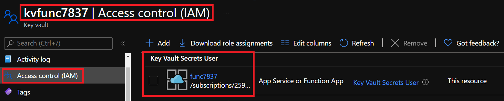

## What is an Azure function?

[Azure Functions](https://docs.microsoft.com/en-us/azure/azure-functions/functions-overview) is a cloud service available on-demand that provides all the continually updated infrastructure and resources needed to run your applications. You focus on the pieces of code that matter most to you, and Functions handles the rest. Functions provides serverless compute for Azure. You can use Functions to build web APIs, respond to database changes, process IoT streams, manage message queues, and more.



## What is Azure Key Vault?

[Azure Key Vault](https://docs.microsoft.com/en-us/azure/key-vault/general/overview) is a cloud service that allows us to protect cryptographic keys, certificates (and the private keys associated with certificates), and secrets (such as connection strings and passwords) in the cloud.

## How to integrate Key Vault with Azure Functions

Because Azure functions are serverless pieces of code, we do not want to put any of our secrets (such as passwords or connection strings) into our function code in plain-text. For security reasons we need to protect the secrets we use in our function code to not expose sensitive information. So today we will look at how we can create a function app using PowerShell Core as the code base, and protect any secrets that we use in our function code with Azure Key Vault.

To get everything ready I will be using Azure CLI in a powershell console. First we will log into Azure by running:

```powershell
az login
```

Next we will create a `resource group`, `storage account`, `key vault`, `app service plan` and `function app` by running:

```powershell
# Variables - Function app and storage account names must be unique.
$randomInt = Get-Random -Maximum 9999
$resourceGroupName = "KeyVaultFunction"
$functionAppName = "func$randomInt"
$storageName = "sa$functionAppName"
$kvName = "kv$functionAppName"
$region = "uksouth"

# Create a resource resourceGroupName
az group create --name "$resourceGroupName" --location "$region"

# Create an azure storage account
az storage account create `
    --name "$storageName" `
    --location "$region" `
    --resource-group "$resourceGroupName" `
    --sku "Standard_LRS" `
    --kind "StorageV2"

# Create an azure key vault (RBAC model)
az keyvault create `
    --name "$kvName" `
    --resource-group "$resourceGroupName" `
    --location "$region" `
    --enable-rbac-authorization

# Create a Function App
az functionapp create `
    --name "$functionAppName" `
    --storage-account "$storageName" `
    --consumption-plan-location "$region" `
    --resource-group "$resourceGroupName" `
    --os-type "Windows" `
    --runtime "powershell" `
    --runtime-version "7.0" `
    --functions-version "3"
```

Next we will enable the function app with a **system assigned** [managed identity](https://docs.microsoft.com/en-us/azure/active-directory/managed-identities-azure-resources/overview) so that we can permission our function app to access our key vault.

Under the function app **settings** pane select **Identity** and enable the **system assigned** setting to be `ON` and save the setting:


With the managed identity now created, we can add a role assignment and permissions (IAM) to our key vault. We will give the function identity the role [Key Vault Secrets User](https://docs.microsoft.com/en-us/azure/role-based-access-control/built-in-roles#key-vault-secrets-user) because we only want the function to be able to retrieve secrets.

On the same **settings** pane where we set the **identity** you will now see a new setting called **Permissions**. Click on **Azure Role Assignments** and add the relevant permissions on the key vault.  
**Note:** You can also add the role assignment permissions on the key vault by going to the key vault and select **IAM** on the key vault directly.


We can also check the **IAM** permissions under our key vault for our function app:



Create some secrets in the key vault for testing:

| Name      | Value               |
| --------- | ------------------- |
| SecUser01 | pwd9000admin        |
| SecPass01 | S8p3r$3cR3t2021!\*! |


Now we will configure our function app to reference our key vault secrets and test the solution.  
We will use the following [Reference syntax](https://docs.microsoft.com/en-us/azure/app-service/app-service-key-vault-references#reference-syntax).

```txt
@Microsoft.KeyVault(VaultName=<myVault>;SecretName=<mySecret>;SecretVersion=<secretVersion>)
```

In addition you can reference a key vault secret using the URI:

```txt
@Microsoft.KeyVault(SecretUri=https://<key-vault-name>.vault.azure.net/secrets/<secret-name>/<secret-version>)
```

**NOTE:** If you want the reference to always take the latest version of the secret from Key Vault, then put the secret identifier URL to the SecretUri, and simply omit the secret version like below. Make sure that the URI **MUST** end with the trailing slash (/).

```txt
@Microsoft.KeyVault(SecretUri=https://<key-vault-name>.vault.azure.net/secrets/<secret-name>/)
```

Under our function **Settings** pane select **Configuration** and add two new **Application settings:**


Under the **Functions** pane click **Add** with the following settings: 

| Name                    | Value             |
| ----------------------- | ----------------- |
| Development Environment | Develop in portal |
| Select a template       | HTTP trigger      |
| New Function            | keyvaultdemo      |
| Authorization level     | Function          |

Next under `Code + Test` copy the following powershell code:

```powershell
using namespace System.Net

# Input bindings are passed in via param block.
param($Request, $TriggerMetadata)

# Write to the Azure Functions log stream.
Write-Host "PowerShell HTTP trigger function processed a request."

# Interact with query parameters or the body of the request.
$name = $Request.Query.Name
if (-not $name) {
    $name = $Request.Body.Name
}

$body = "This HTTP triggered function executed successfully. Pass a name in the query string or in the request body for a personalized response."

$User = $ENV:kv_SecUser01
$Pass = $ENV:kv_SecPass01

Write-Host "Username retrieved from key vault: $User"
Write-Host "Password retrieved from key vault: $Pass"

if ($name) {
    $body = "Hello, $name. This HTTP triggered function executed successfully."
}

# Associate values to output bindings by calling 'Push-OutputBinding'.
Push-OutputBinding -Name Response -Value ([HttpResponseContext]@{
    StatusCode = [HttpStatusCode]::OK
    Body = $body
})
```

Here is also a [Link](https://github.com/Pwd9000-ML/blog-devto/tree/main/posts/2021/Azure-KeyVault-Function-Integrate/code/function.ps1) to the function code.

**Note:** Our secret references that we configured on the functions application settings are loaded into environment variables as you can see from the function code above:

```powershell
$User = $ENV:kv_SecUser01
$Pass = $ENV:kv_SecPass01

Write-Host "Username retrieved from key vault: $User"
Write-Host "Password retrieved from key vault: $Pass"
```

## Testing our function app

Let's test our function app by triggering the code manually using **Test/Run** to see if our function can retrieve our secrets we specified.


I hope you have enjoyed this post and have learned something new. You can also find the code samples used in this blog post on my [GitHub](https://github.com/Pwd9000-ML/blog-devto/tree/main/posts/2021/Azure-KeyVault-Function-Integrate/code) page. :heart:

### _Author_

Like, share, follow me on: :octopus: [GitHub](https://github.com/Pwd9000-ML) | :penguin: [Twitter](https://twitter.com/pwd9000) | :space_invader: [LinkedIn](https://www.linkedin.com/in/marcel-l-61b0a96b/)



<a href="https://www.buymeacoffee.com/pwd9000"></a>
