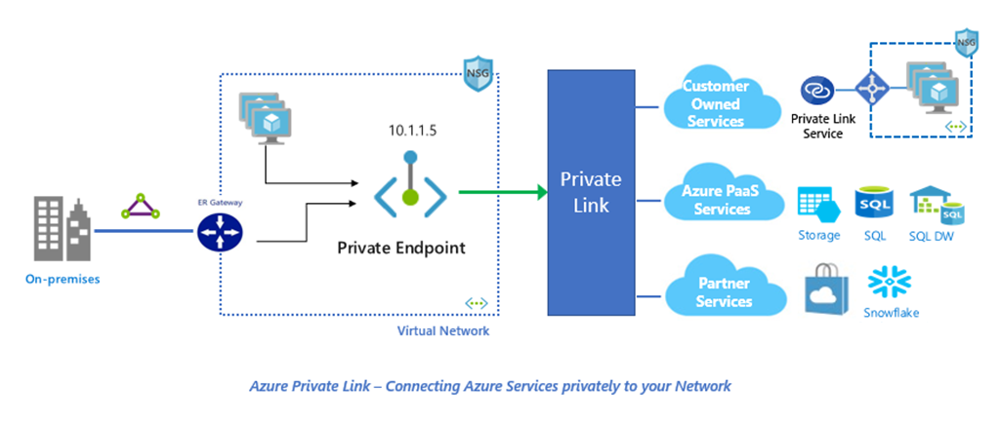

## What is an Azure Logic app?

[Azure Logic Apps](https://docs.microsoft.com/en-us/azure/logic-apps/logic-apps-overview) is a cloud-based platform for creating and running automated workflows that integrate your apps, data, services, and systems. With this platform, you can quickly develop highly scalable integration solutions for your enterprise and business-to-business (B2B) scenarios. As a member of Azure Integration Services, Logic Apps simplifies the way that you connect legacy, modern, and cutting-edge systems across cloud, on premises, and hybrid environments.

## What is Azure Private Link (Private Endpoint)?

[Azure Private Link](https://docs.microsoft.com/en-us/azure/private-link/private-link-overview) (Private Endpoint) allows you to access Azure PaaS services over a Private IP address within the VNet. The PaaS resource gets a new private IP via a virtual network interface (NIC) on your VNet attached to the PaaS resource, making the PaaS resource truly an internal resource to your network. When you send traffic to the PaaS resource, it will always ensure traffic stays within your VNet boundary.



## What is new in Azure Logic apps?

There has some been some major architectural changes and improvements made in recent days to Azure Logic apps (multi-tenant implementation), especially the new logic apps runtime which is a re-hostable containerized, single-tenant runtime, which is built on top of the `Azure Functions runtime`, adding some excellent new features that we can now utilise in our logic apps. Such as enabling `managed service identity (MSI)` on our logic apps, cross-platform support, local development and testing using VSCode, enabling new advanced networking features such as `private endpoints` which we will focus on in todays tutorial or even running our logic apps in a dedicated compute resource in Azure, Docker or Kubernetes environments.

## What do we need?

1. **Azure Virtual Network:** We will need either a new or an existing VNET in which we can attach our logic app private endpoint interface.
2. **Azure Private DNS Zone:** For this tutorial we will also create a Private DNS zone to host our [private endpoint DNS Configuration](https://docs.microsoft.com/en-us/azure/private-link/private-endpoint-dns#azure-services-dns-zone-configuration).
3. **Azure Logic App:** We will need to create the new `single-tenant` logic app as described above.
4. **Private Endpoint:** We will use a private endpoint to connect our logic app to our VNET.

## Creating an Azure Virtual Network (VNET)?

For this section I will be using Azure CLI in a powershell console. First we will log into Azure by running:

```powershell
az login
```

Next we will create a `resource group`, and a `VNET` by running:

```powershell
# variables.
$resourceGroupName = "MyLogicAppRG"
$vnetName = "LogicAppNet"
$subnetName = "LogicAppSub"
$region = "uksouth"

# Create a resource resourceGroupName
az group create --name "$resourceGroupName" --location "$region"

# Create a new Vnet
az network vnet create `
  --name "$vnetName" `
  --resource-group "$resourceGroupName" `
  --address-prefixes 10.2.0.0/16 `
  --subnet-name "$subnetName" `
  --subnet-prefixes 10.2.0.0/24
```

## Creating an Azure Private DNS Zone?

We will need to register our private endpoint in DNS so for this step we will create a Private DNS Zone and link the `Azure services DNS Zone configuration` for `azurewebsites.net` because our new logic app runtime is within an `App Service Plan (ASP)` we will configure the zone as `privatelink.azurewebsites.net`.

To see more detailed information on DNS configurations for private endpoints please see [`DNS Integration Scenarios`](https://github.com/dmauser/PrivateLink/tree/master/DNS-Integration-Scenarios) for additional information, as well as [Private link DNS Zone configuration](https://docs.microsoft.com/en-us/azure/private-link/private-endpoint-dns#azure-services-dns-zone-configuration)

Next we will run:

```powershell
# Create Private DNS Zone
az network private-dns zone create `
    --resource-group "$resourceGroupName" `
    --name "privatelink.azurewebsites.net"

# Link Private DNS Zone with VNET
az network private-dns link vnet create `
    --resource-group "$resourceGroupName" `
    --name "$vnetName-DNS-Link" `
    --zone-name "privatelink.azurewebsites.net" `
    --virtual-network "$vnetName" `
    --registration-enabled "true"
```

## Creating an Azure Logic app (Single-tenant)?

## Creating the Private Endpoint ?

### _Author_

Marcel.L - pwd9000@hotmail.co.uk
