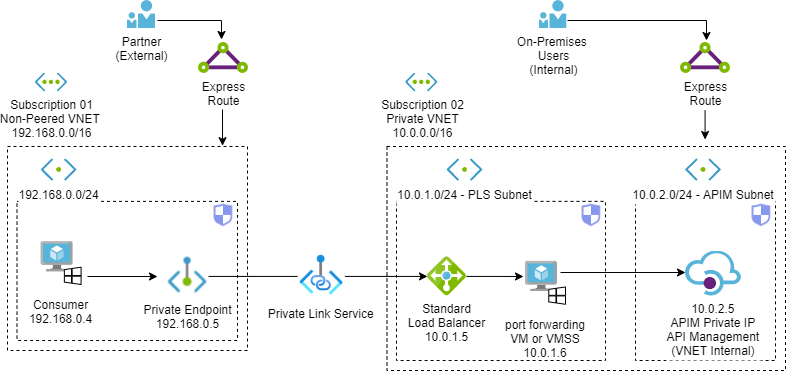

## What is Azure Private Link Service?

[Azure Private Link service](https://docs.microsoft.com/en-us/azure/private-link/private-link-service-overview) is the reference to your own service that is powered by Azure Private Link. Your service that is running behind Azure Standard Load Balancer can be enabled for Private Link access so that consumers to your service can access it privately from their own VNets. Your customers can create a private endpoint inside their VNet and map it to this service.

### Access internal API Management Service securely with Private Link Service from an external non-peered VNET

In todays tutorial we will look into an interesting use case for this service, in how we can connect an external source to consume an API management service (internal VNET mode) from an external non-peered VNET. As depicted in the following diagram:



**Note:** The source or entry point where we will place out private endpoint can be in a network that is in a completely different region, tenant or subscription.

Before we get started, let's just think about why we would want to do this?  

**APIM (Internal VNET mode):** When API management deploys in internal VNET mode, you can only view the service endpoints within a VNET whose access you control. In order to reduce the attack surface area, configuring APIM with all it's endpoints (e.g. gateway, APIM portals and management endpoints) will be protected within an internal VNET, and cannot be directly accessed from any potential threats from the public internet. The service can only be accessed from peered VNETs tha have connectivity to our VNET hosting our APIM service.  

This is all good security and practice, but what if we have a requirement where we have a consumer that needs to use our API that is located in another VNET that perhaps overlaps IP address space and cannot be peered or connected to our VNET hosting our APIM service? Or what is we have a close business partner or company that has a VNET in a completely separate region, tenant and subscription? How can we make our API management service available to such consumers and keep everything internal and secure at the same time?  

Luckily there is a solution to this problem statement, and the answer is Azure private link service. With Azure Private Link Service we can create a **Standard Load Balancer** that will be connected to a **Virtual Machine** or **Virtual Machine Scale Set** which will act as a relay using **IP/Port forwarding** to our internal APIM, we will front the load balancer with **Private Link Service** and create a **Private endpoint** on our source network that will allow entry point connectivity.  

## What do we need?

1. **Azure Virtual Network:** We will need either a new or an existing VNET with two subnets for our Private Link Service and APIM.
2. **APIM (Internal VNET mode):** For this tutorial we will create an [internal APIM](https://docs.microsoft.com/en-us/azure/api-management/api-management-using-with-internal-vnet).
3. **VM or VMMS:** For this tutorial we will create a single windows VM and configure it to be a forwarder to our internal APIM. (You can also use a VMSS instead)
4. **Standard Load Balancer:** We will use a standard load balancer to front our connect VM/VMSS which will be used by the private link service.
5. **Private Link Service:** We will create a Private link service and connect it up with our load balancer.
6. **Private Endpoint:** We will then create a private endpoint in the external VNET and test our connectivity to our internal APIM from the external network.

To get everything ready I will be using Azure CLI in a powershell console. First we will log into Azure by running:

```powershell
az login
```

Next we will create a `resource group`, `virtual network` and `APIM (internal VNET mode)` by running:

```powershell
# Variables.
$randomInt = Get-Random -Maximum 9999
$resourceGroupName = "PrivateAPIM"
$apimName = "apim$randomInt"
$region = "uksouth"
```

Next we will create our `Virtual machine` that will be used as a forwarder by running:

```powershell
# Variables.
```

### _Author_

Marcel.L - pwd9000@hotmail.co.uk
