## What is Azure Private Link Service?

[Azure Private Link service](https://docs.microsoft.com/en-us/azure/private-link/private-link-service-overview) is the reference to your own service that is powered by Azure Private Link. Your service that is running behind Azure Standard Load Balancer can be enabled for Private Link access so that consumers to your service can access it privately from their own VNets. Your customers can create a private endpoint inside their VNet and map it to this service.

### Access internal API Management Service securely with Private Link Service from an external non-peered VNET

In todays tutorial we will look into an interesting use case for this service, in how we can connect an external source to consume an API management service (internal VNET mode) from an external non-peered VNET. As depicted in the following diagram:

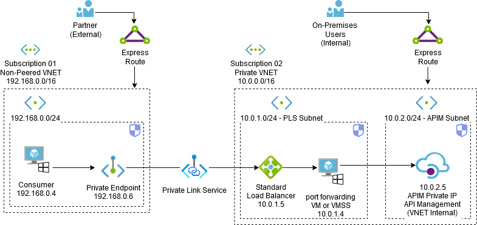

**Note:** The source or entry point where we will place our private endpoint can be in a network that is in a completely different region, tenant or subscription.

Before we get started, let's just think about why we would want to do this?  

**APIM (Internal VNET mode):** When API management deploys in internal VNET mode, you can only view the service endpoints within a VNET whose access you control. In order to reduce the attack surface area, configuring APIM with all it's endpoints (e.g. gateway, APIM portals and management endpoints) will be protected within an internal VNET, and cannot be directly accessed from any potential threats from the public internet. The service can only be accessed from peered VNETs that have connectivity to our VNET hosting our APIM service.  

This is good security practice, but what if we have a requirement where we have a consumer that needs to use our API, but is located in another VNET that perhaps overlaps IP address space and cannot be peered or connected to our VNET hosting our APIM service? Or what if we have a business partner or sister company that has a VNET in a completely separate region, tenant and subscription? How can we make our API management service available to consumers such as this and keep everything internal and secure at the same time?  

Luckily there is a solution to this problem statement, and that is Azure private link service. With Azure Private Link Service we can create a **Standard Load Balancer** that will be connected to a **Virtual Machine** or **Virtual Machine Scale Set** which will act as a relay using **IP/Port forwarding** to our internal APIM, we will front the load balancer with **Private Link Service** and create a **Private endpoint** on our external network that will allow entry point connectivity to our internal APIM.

## What do we need?

1. **Azure Virtual Network:** We will need either a new or an existing VNET with two subnets for our Private Link Service and APIM.
2. **APIM (Internal VNET mode):** For this tutorial we will create an [internal APIM](https://docs.microsoft.com/en-us/azure/api-management/api-management-using-with-internal-vnet).
3. **VM or VMMS:** For this tutorial we will create a single windows VM and configure it to be a forwarder to our internal APIM. (You can also use a Virtual Machine Scale Set (VMSS) instead).
4. **Standard Load Balancer:** We will use a standard load balancer to front our VM/VMSS which will be used by the private link service.
5. **Private Link Service:** We will create a Private link service and link it up with our load balancer.
6. **Private Endpoint:** We will then create a private endpoint in the external VNET and test our connectivity to our internal APIM from the non-peered network.

To get everything ready I will be using AZ powershell. First we will log into Azure by running:

```powershell
Login-AzAccount
```

Next we will create a `resource group`, `virtual network` and `APIM (internal VNET mode)` by running:

```powershell
##./code/APIM-pre-reqs.ps1
# Variables.
$randomInt = Get-Random -Maximum 9999
$resourceGroupName = "PrivateAPIM"
$vnetName = "MainNet"
$apimSubnetName = "apimSubnet"
$plsSubnetName = "plsSubnet"
$apimName = "apim$randomInt"
$region = "uksouth"

# Create a resource resourceGroupName
New-AzResourceGroup -Name "$resourceGroupName" -Location "$region"

# Create NSG and pls (private link service) subnet.
$plsRule1 = New-AzNetworkSecurityRuleConfig `
    -Name "pls-in" `
    -Description "PLS inbound" `
    -Access "Allow" `
    -Protocol "Tcp" `
    -Direction "Inbound" `
    -Priority 100 `
    -SourceAddressPrefix "VirtualNetwork" `
    -SourcePortRange "*" `
    -DestinationAddressPrefix "VirtualNetwork" `
    -DestinationPortRange 443

$plsNsg = New-AzNetworkSecurityGroup `
    -ResourceGroupName "$resourceGroupName" `
    -Location "$region" `
    -Name "NSG-PLS" `
    -SecurityRules $plsRule1

$plsSubnet = New-AzVirtualNetworkSubnetConfig `
    -Name "$plsSubnetName" `
    -NetworkSecurityGroup $plsNsg `
    -AddressPrefix 10.0.1.0/24

# Create NSG and APIM subnet subnet.
$apimRule1 = New-AzNetworkSecurityRuleConfig `
    -Name "apim-in" `
    -Description "APIM inbound" `
    -Access "Allow" `
    -Protocol "Tcp" `
    -Direction "Inbound" `
    -Priority 100 `
    -SourceAddressPrefix "ApiManagement" `
    -SourcePortRange "*" `
    -DestinationAddressPrefix "VirtualNetwork" `
    -DestinationPortRange 3443

$apimNsg = New-AzNetworkSecurityGroup `
    -ResourceGroupName "$resourceGroupName" `
    -Location "$region" `
    -Name "NSG-APIM" `
    -SecurityRules $apimRule1

$apimSubnet = New-AzVirtualNetworkSubnetConfig `
    -Name "$apimSubnetName" `
    -NetworkSecurityGroup $apimNsg `
    -AddressPrefix 10.0.2.0/24

# Create VNET
Write-Output "Creating Virtual Network... Please Wait..."
$vnet = New-AzVirtualNetwork `
    -Name "$vnetName" `
    -ResourceGroupName "$resourceGroupName" `
    -Location "$region" `
    -AddressPrefix "10.0.0.0/16" `
    -Subnet $plsSubnet,$apimSubnet

#Get APIM subnet ID
$plsSubnetData = $vnet.Subnets[0]
$apimSubnetData = $vnet.Subnets[1]

# Create an API Management service instance. (Developer SKU for this demo... SKUs: Basic, Consumption, Developer, Premium, Standard)
Write-Output "Creating APIM service... Please Wait..."
$apimVirtualNetwork = New-AzApiManagementVirtualNetwork -SubnetResourceId $apimSubnetData.Id
$apimService = New-AzApiManagement `
    -ResourceGroupName "$resourceGroupName" `
    -Location "$region" `
    -Name "$apimName" `
    -Organization "pwd9000" `
    -AdminEmail "pwd9000@hotmail.co.uk" `
    -VirtualNetwork $apimVirtualNetwork `
    -VpnType "Internal" -Sku "Developer"
```

**Note:** Because we are creating a new APIM service for this tutorial, the above powershell code can take anything between 10-20 minutes to complete.  

After our APIM is created make a note of the APIM **Private IP** as we will use this in a later step to configure our VM forwarder.  

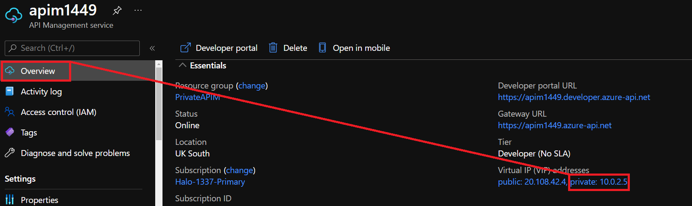

Next we will create our `Virtual machine` in the pls subnet, that will be used as a forwarder:

```powershell
##./code/VM-forwarder.ps1
$vmLocalAdmin = "pwd9000admin"
$vmLocalAdminPassword = Read-Host -assecurestring "Please enter your password"
$region = "uksouth"
$resourceGroupName = "PrivateAPIM"
$computerName = "VmPls01"
$vmName = "VmPls01"
$vmSize = "Standard_DS2_V2"
$networkName = "MainNet"
$nicName = "VmPls01-nic"
$vNet = Get-AzVirtualNetwork -Name $NetworkName
$plsSubnetId = ($vnet.Subnets | Where-Object {$_.name -eq "plsSubnet"}).id

$NIC = New-AzNetworkInterface -Name $nicName -ResourceGroupName $resourceGroupName -Location $region -SubnetId $plsSubnetId -EnableIPForwarding
$Credential = New-Object System.Management.Automation.PSCredential ($vmLocalAdmin, $vmLocalAdminPassword);
$VirtualMachine = New-AzVMConfig -VMName $vmName -VMSize $vmSize
$VirtualMachine = Set-AzVMOperatingSystem -VM $VirtualMachine -Windows -ComputerName $computerName -Credential $Credential -ProvisionVMAgent -EnableAutoUpdate
$VirtualMachine = Add-AzVMNetworkInterface -VM $VirtualMachine -Id $NIC.Id
$VirtualMachine = Set-AzVMSourceImage -VM $VirtualMachine -PublisherName 'MicrosoftWindowsServer' -Offer 'WindowsServer' -Skus '2019-Datacenter' -Version latest
$VirtualMachine = Set-AzVMOSDisk -VM $VirtualMachine -StorageAccountType "Standard_LRS" -CreateOption FromImage -Windows | Set-AzVMBootDiagnostic -Disable

New-AzVM -ResourceGroupName $resourceGroupName -Location $region -VM $VirtualMachine -Verbose
```

**Note:** IP Forwarding has been enabled on the network interface of the VM.

```txt
// code/VM-forwarder.ps1#L13-L13
```

After our VM is created we need to run a few commands on the VM to allow certain traffic to be forwarded and passed through to APIM. First we will enable IP Router in the VM registry, create a firewall rule to allow https(TCP port 443) traffic inbound and lastly enable forwarding to our APIM private IP address using `netsh`.  

Run the following powershell commands on the newly created VM:

```powershell
##./code/VM-forwarder-config.ps1
#vars (APIM private IP after APIM created under $apimPrivateIP)
$port = '443'
$localaddress = (Get-NetIPConfiguration | Where-Object {$_.ipv4defaultgateway -ne $null}).IPv4Address.ipaddress
$apimPrivateIP = '10.0.2.5'

#Enable Port Forwarding on VM. 
#Enable IP forwarding on Azure for the VM's #network interface as well.
Set-ItemProperty -Path HKLM:\SYSTEM\CurrentControlSet\Services\Tcpip\Parameters -Name IpEnableRouter -Value 1
 
#Allow HTTPS(443) traffic inbound
New-NetFirewallRule -DisplayName "HTTPS-443-Inbound" -Direction Inbound -Action Allow -Protocol TCP -LocalPort $port

#Enable port 443 listener and forward
netsh interface portproxy add v4tov4 listenport=$port listenaddress=$localaddress connectport=$port connectaddress=$apimPrivateIP
```

- Confirm `IP Enable Router` has been activated:

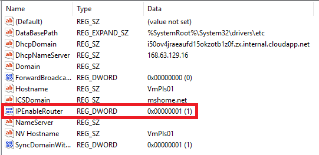

- Confirm inbound firewall rule has been created for TCP port 443:

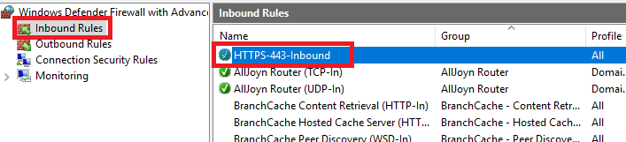

- Confirm there is a new listener on port 443 and forwarding set up (Netstat -AN):

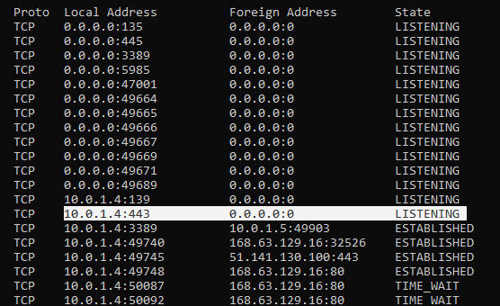

After confirming that all the config is there and correct, we can restart our VM and proceed to the next step in setting up our **Standard Load Balancer**:

```powershell
##./code/Standard-Load-Balancer.ps1
# Variables.
$resourceGroupName = "PrivateAPIM"
$vnetName = "MainNet"
$plsSubnet = ($vnet.Subnets | Where-Object {$_.name -eq "plsSubnet"}).id
$region = "uksouth"

#Vnet object
$vnet = Get-AzVirtualNetwork -Name $vnetName -ResourceGroupName $resourceGroupName

#load balancer frontend configuration
$feip = New-AzLoadBalancerFrontendIpConfig -Name 'plsFrontEnd' -PrivateIpAddress '10.0.1.5' -SubnetId $plsSubnet

#backend address pool configuration
$bepool = New-AzLoadBalancerBackendAddressPoolConfig -Name 'plsVMforwarderPool'

#health probe
$healthprobe = New-AzLoadBalancerProbeConfig -Name 'Check443' -Protocol 'Tcp' -Port '443' -IntervalInSeconds '360' -ProbeCount '5'

# load balancer rule
$rule = New-AzLoadBalancerRuleConfig -Name 'plsHTTPS' -Protocol 'Tcp' -FrontendPort '443' -BackendPort '443' -IdleTimeoutInMinutes '15' -FrontendIpConfiguration $feip -BackendAddressPool $bepool -EnableTcpReset

## Create the load balancer resource
$loadbalancer = @{
    ResourceGroupName = $resourceGroupName
    Name = 'PrivateLinkServiceLB'
    Location = $region
    Sku = 'Standard'
    FrontendIpConfiguration = $feip
    BackendAddressPool = $bePool
    LoadBalancingRule = $rule
    Probe = $healthprobe
}
New-AzLoadBalancer @loadbalancer
```

After our load balancer is created we can add our VM into the backend pool which is called **plsVMforwarderPool**.

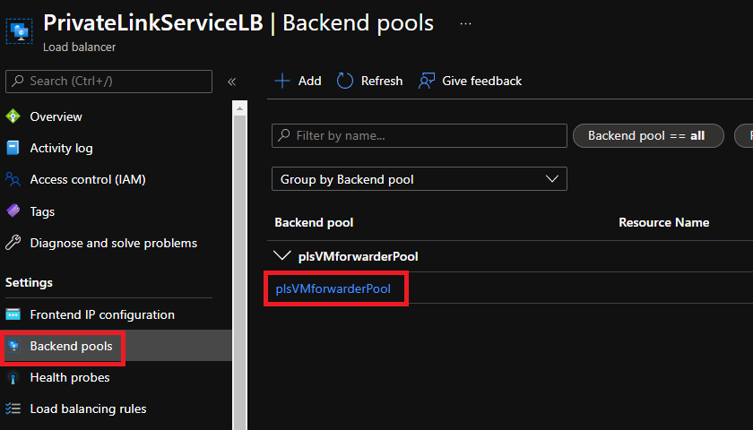

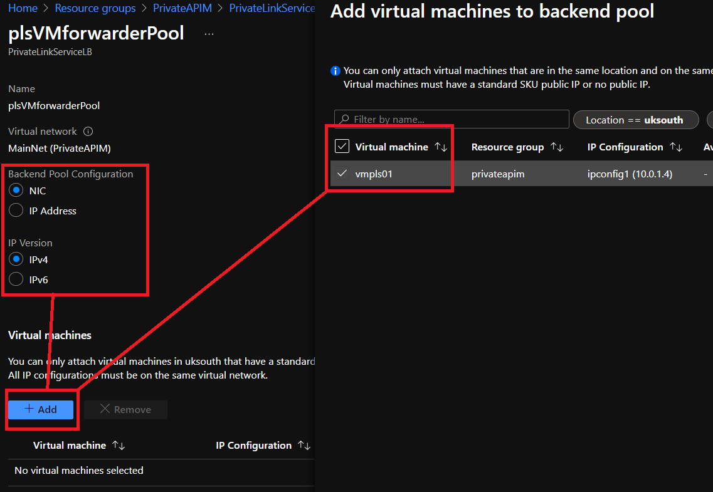

After a few minutes we will see that our health probe is working as well which periodically checks port 443 on our forwarder VM.

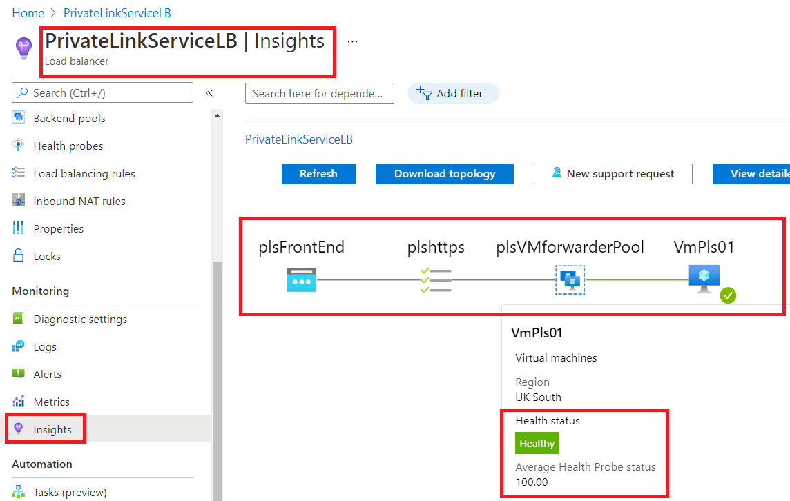

Next we will create our **Private Link Service** using the load balancer we created, then create a **Private Endpoint** on our remote non-peered VNET. We will also test that we can reach APIM using the Private endpoint from a test VM running in our external non-peered VNET.  

In the Azure portal go to `Private Link` and select `+ Add` under `Private Link Services`.

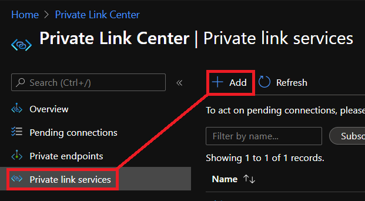

Under the **Basics** blade, add the following:

| Name            | Value               |
| --------------- | ------------------- |
| Resource Group  | PrivateAPIM         |
| Name            | APIM-PLS            |
| Region          | UK South            |

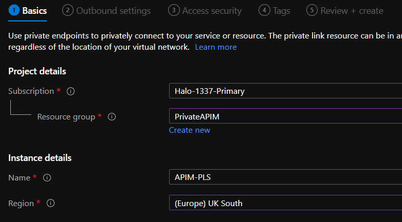

Under the **Outbound settings** blade, add the following:

| Name                | Value                   |
| ------------------- | ----------------------- |
| Load Balancer       | PrivateLinkServiceLB    |
| Frontend IP         | plsFrontEnd (10.0.1.5)  |
| Source NAT VNET     | MainNet                 |
| Source NAT Subnet   | plsSubnet (10.0.1.0/24) |
| Enable TCP proxy V2 | No                      |
| Private IP address  | Dynamic                 |

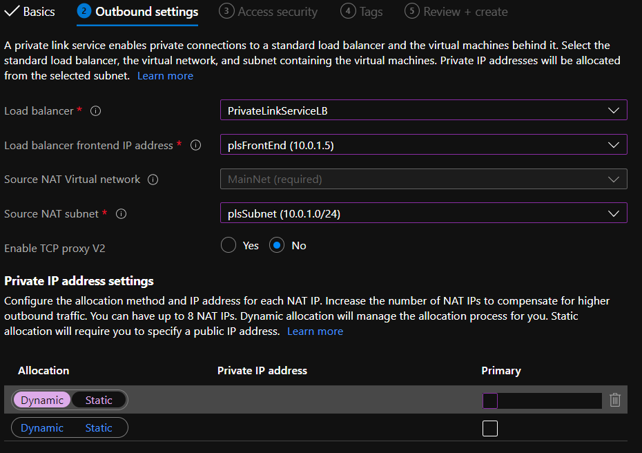

Under the **Access Security** blade, we will use **Restricted by subscription** with a list of our two subscriptions. For more details on the different types of access: `Role-based access control only`, `Restricted by subscription`, `Anyone with your alias`, see this [LINK](https://docs.microsoft.com/en-gb/azure/private-link/private-link-service-overview#control-service-exposure).

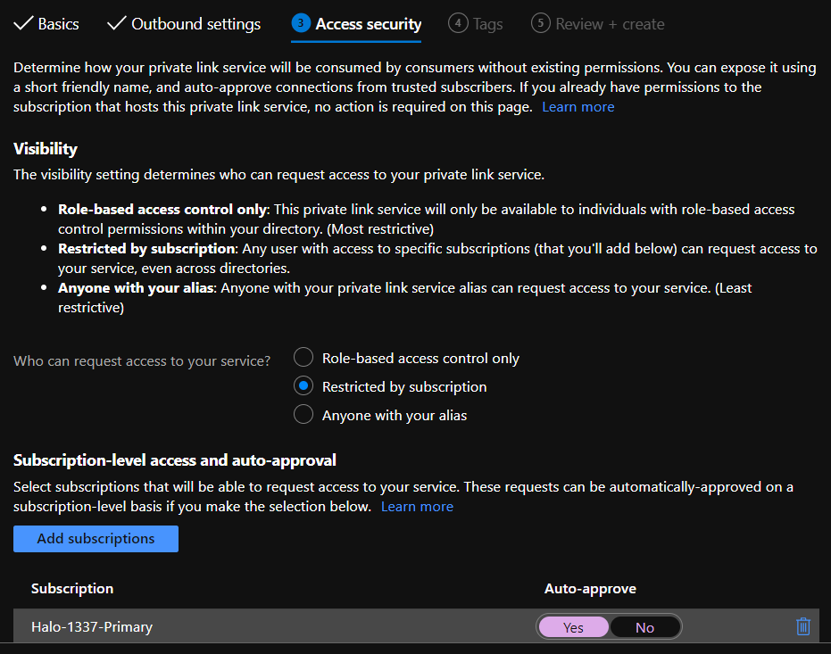

Add any tags if required and then create the private link service.  

Now that our Private Link Service is created I will navigate to my other subscription I created separately. There I will create and link a **Private Endpoint** on an external non-peered VNET which resides in the **EAST US** region. You can do the same by creating a new VNET in a different region and leaving it un-peered.

In the Azure portal go to `Private Link` and select `+ Add` under `Private endpoints`.

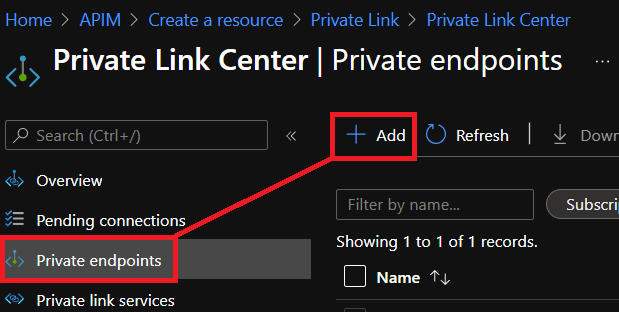

Under the **Basics** blade, select the subscription, and region where the external VNET resides (in my case this is in EAST US):

| Name            | Value               |
| --------------- | ------------------- |
| Resource Group  | APIM                |
| Name            | APIM-PE             |
| Region          | East US             |

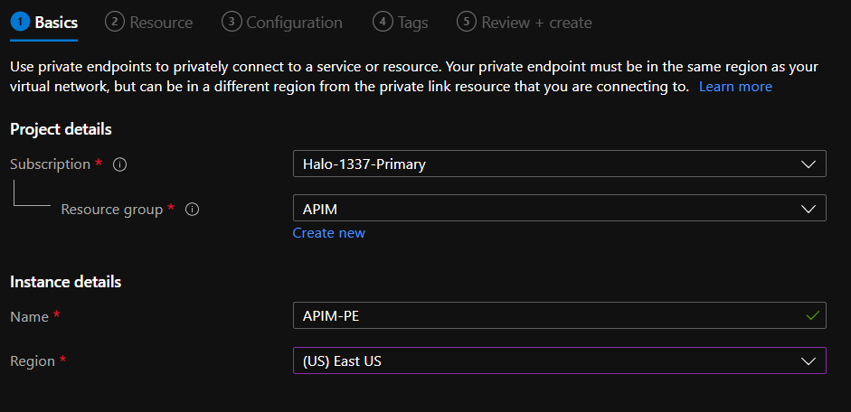

Under the **Resource** blade, you can connect to the PLS service we created by it's `resource ID` or by selecting the following:

| Name            | Value                                 |
| --------------- | ------------------------------------- |
| Subscription    | [Subscription hosting PLS]            |
| Resource Type   | Microsoft.Network/privateLinkservices |
| Resource        | APIM-PLS                              |

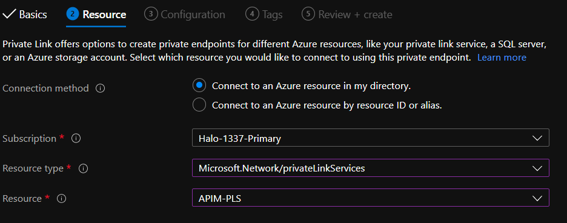

Under the **Configuration** blade, select the external virtual network (in my case this is hosted in EAST US and my VNET is called `External`):

| Name            | Value                  |
| --------------- | ---------------------- |
| Virtual Network | [external VNET name]   |
| Subnet          | [External VNET subnet] |

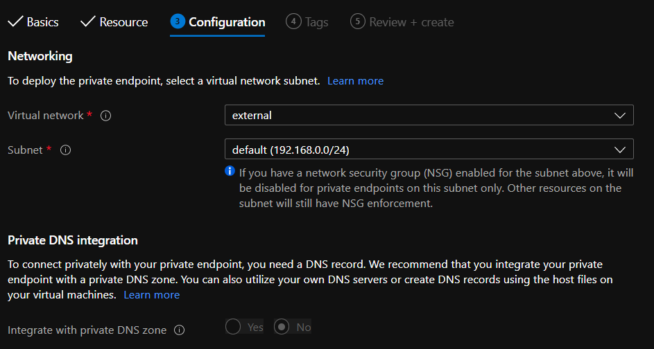

Add any tags if required and then create the private endpoint.  

And that is it, we have now successfully created a secure entry point to access our private APIM service from a non-peered external VNET hosted in EAST US. I have a VM running in my EAST US external VNET in which we can test our connectivity via the private endpoint we just created. In my case the private endpoint IP allocated to APIM-PE is: `192.168.0.6`.

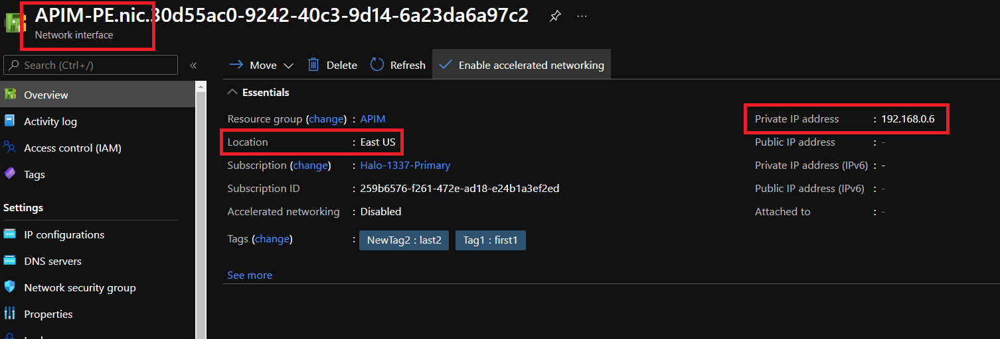

My test VM running in my external VNET has an IP of: `192.168.0.4`.

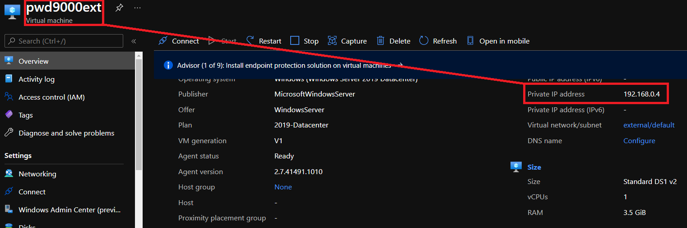

To test connectivity to my APIM I will require my APIM endpoints and for this test I will just configure my endpoints on my test machine using the local HOSTS file, but point my APIM endpoints to the APIM-PE (private endpoint we created).

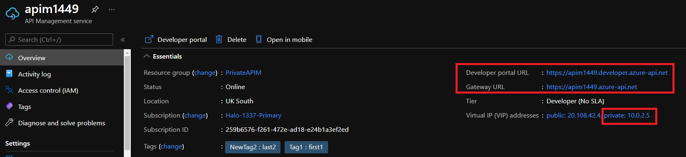

Let's see if our connectivity is working:

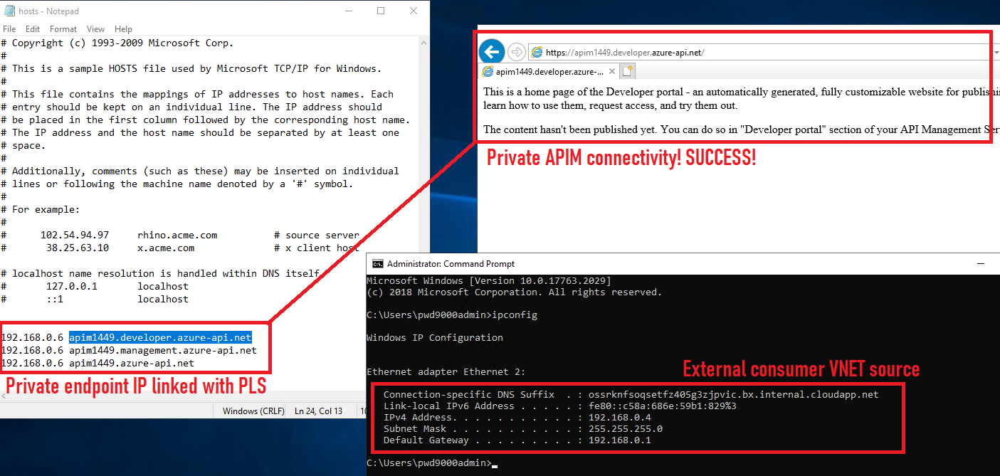

I hope you have enjoyed this post and have learned something new. You can also find the code samples used in this blog post on my [Github](https://github.com/Pwd9000-ML/blog-devto/tree/master/posts/Azure-Private-Link-Service-Internal-APIM/code). :heart:

### _Author_

Marcel.L - pwd9000@hotmail.co.uk
