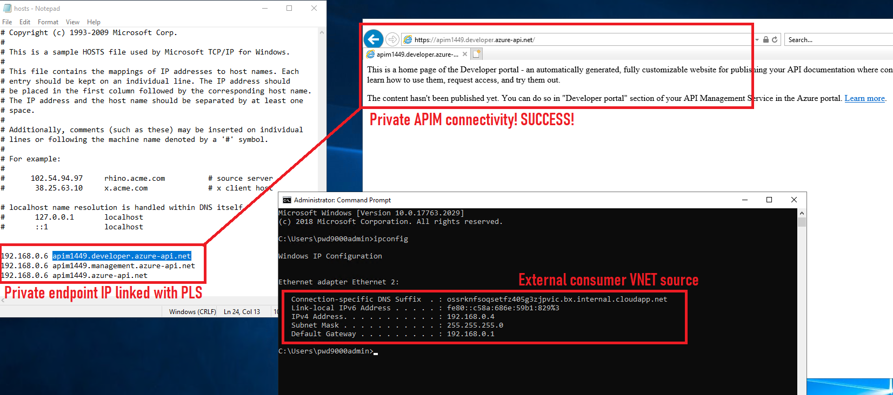

Let's see if our connectivity is working:

I hope you have enjoyed this post and have learned something new. You can also find the code samples used in this blog post on my [Github](https://github.com/Pwd9000-ML/blog-devto/tree/master/posts/Azure-Private-Link-Service-Internal-APIM/code). :heart:

### _Author_

Marcel.L - pwd9000@hotmail.co.uk
