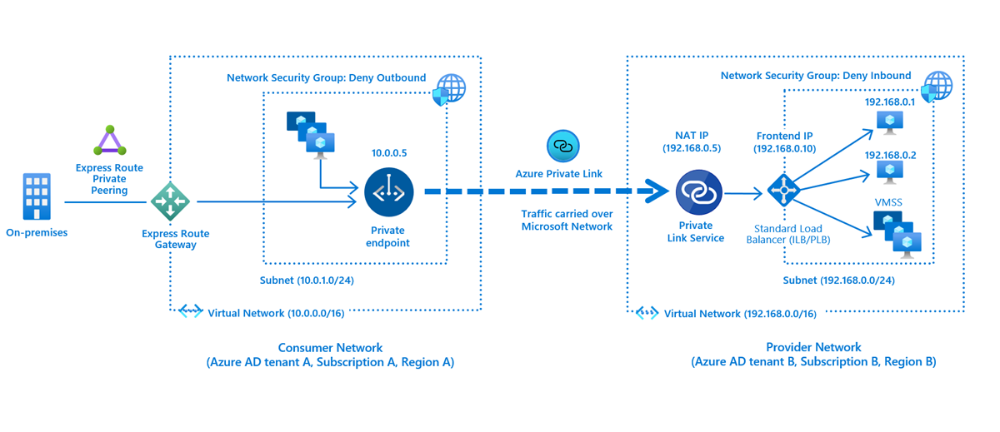

## What is Azure Private Link Service?

[Azure Private Link service](https://docs.microsoft.com/en-us/azure/private-link/private-link-service-overview) is the reference to your own service that is powered by Azure Private Link. Your service that is running behind Azure Standard Load Balancer can be enabled for Private Link access so that consumers to your service can access it privately from their own VNets. Your customers can create a private endpoint inside their VNet and map it to this service.

