## What is an Azure function?

Azure Functions is a cloud service available on-demand that provides all the continually updated infrastructure and resources needed to run your applications. You focus on the pieces of code that matter most to you, and Functions handles the rest. Functions provides serverless compute for Azure. You can use Functions to build web APIs, respond to database changes, process IoT streams, manage message queues, and more.  



For more details on Azure Functions have a look at the [Microsoft Documentation](https://docs.microsoft.com/en-us/azure/azure-functions/functions-overview)  

## How to control Azure virtual machines power states using an Azure function

Today we will look at how we can create a function app using PowerShell Core as the code base, that will allow us to check the power state of a virtual machine or stop/start a virtual machine by passing a URL request via a HTTP trigger to the function app.  

To get everything ready I will be using Azure CLI in a powershell console. First we will log into Azure by running:

```powershell
az login
```

Next we will create a `resource group`, `storage account`, `app service plan` and `function app` by running:

```powershell
# Function app and storage account names must be unique.
$randomInt = Get-Random -Maximum 9999
$resourceGroupName = "VmPowerFunction"
$storageName = "vmpowersa$randomInt"
$functionAppName = "vmpowerfunc$randomInt"
$region = "uksouth"

# Create a resource resourceGroupName
az group create --name "$resourceGroupName" --location "$region"

# Create an azure storage account
az storage account create `
    --name "$storageName" `
    --location "$region" `
    --resource-group "$resourceGroupName" `
    --sku "Standard_LRS" `
    --kind "StorageV2"

# Create a Function App
az functionapp create `
    --name "$functionAppName" `
    --storage-account "$storageName" `
    --consumption-plan-location "$region" `
    --resource-group "$resourceGroupName" `
    --os-type "Windows" `
    --runtime "powershell" `
    --runtime-version "7.0" `
    --functions-version "3"
```

**Note:** In this tutorial we are using a [`Consumption`](https://docs.microsoft.com/en-us/azure/azure-functions/consumption-plan) app service plan and not a [`dedicated`](https://docs.microsoft.com/en-us/azure/azure-functions/dedicated-plan) or [`premium`](https://docs.microsoft.com/en-us/azure/azure-functions/functions-premium-plan?tabs=portal) plan. You can however change the plan if needed as the consumption plan may take a bit of time to start up once we start using it. But for the purposes of this tutorial and use case this plan will be sufficient enough for our function.  

Next we will enable the function app with a `system assigned` [`managed identity`](https://docs.microsoft.com/en-us/azure/active-directory/managed-identities-azure-resources/overview) so that we can permission our function app against the virtual machines we will be maintaining. Under the function app `settings` pane select `Identity` and enable the `system assigned` setting to be `ON` and save the setting:

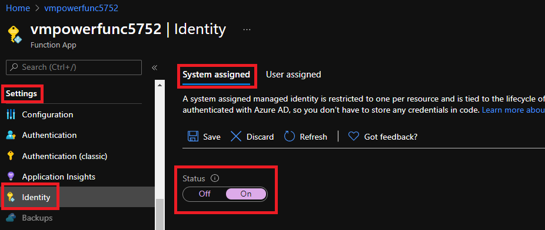

With the Managed Identity now created, we can add a Role assignment and permissions (IAM) to the Subscription or Resource Group where our Vms reside. We will also give the function app the role `Virtual Machine Contributor` because we only want the app to be able to check the status of a VM and the ability to either stop or start a VM. On the same `settings` pane where we set the `identity` you will now see a new setting called `Permissions`. Click on `Azure Role Assignments` and add the relevant permissions at the resource group scope where the Vms resides.  
**Note:** You can also add the role assignment permissions via `IAM` at a desired scope such as at a management group or subscription scope.  

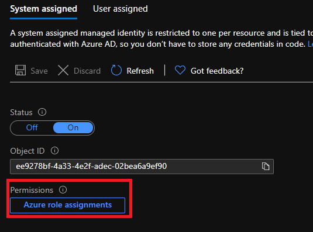

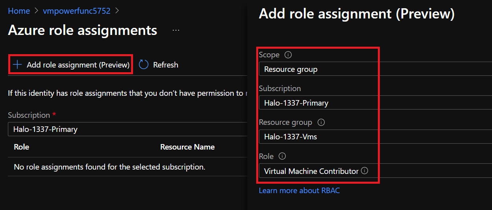

If you check the `IAM` permissions now under the scope we added the role assignment, you should see the `IAM` permission for our function app:  

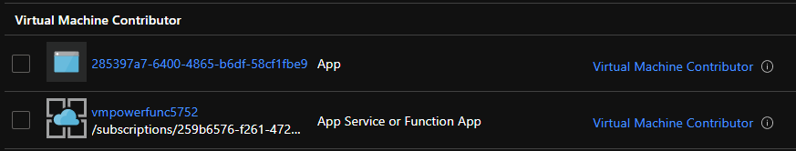

Now we will configure our function app with the powershell code and triggers to finalize the solution.  
Under the `Functions` pane click `Add` with the following settings:  

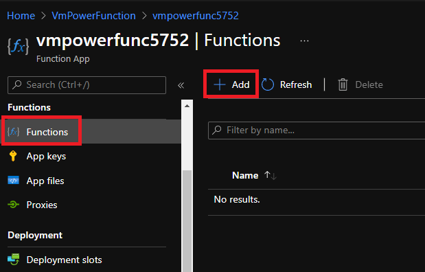  

**Development Enviornment:** `Develop in portal`  
**Select a template:** `HTTP trigger`  
**New Function:** `VmPowerState`  
**Authorization level:** `Function`  

Next under `Code + Test` copy the following powershell code:  

```powershell
#// code/vmPowerFunction.ps1

using namespace System.Net

# Input bindings are passed in via param block.
param($request, $TriggerMetadata)

#Set default value
$status = 200

Try{
    # Write to the Azure Functions log stream.
    Write-Output "PowerShell HTTP trigger function processed a request."

    # Interact with query parameters or the body of the request.
    Write-Output ($request | ConvertTo-Json -depth 99)

    $ResourceGroupName = $request.query.ResourceGroupName
    $VMName = $request.query.VMName
    $Context =  $request.query.Context
    $Action = $request.query.Action
    
    $null = Connect-AzAccount -Identity
    $null = Set-AzContext $Context

    $vmStatus = Get-AzVM -ResourceGroupName $ResourceGroupName -Name $VMName -Status
    Write-output $vmStatus
    If(-not ($vmStatus)){
        $status = 404
        Throw 'ERROR! VM not found'
    }
    [string]$Message = "Virtual machine status: " + $vmStatus.statuses[-1].displayStatus
    Switch($Action){
        'start'{
            If($vmStatus.statuses[-1].displayStatus -ne 'VM running'){
                Start-AzVM -ResourceGroupName $ResourceGroupName -Name $VMName -Verbose
                [string]$message += '... Virtual machine is now starting'
            }
            Else{
                [string]$message += '... Virtual machine is already running'
            }
        }
        'stop'{
            If($vmStatus.statuses[-1].displayStatus -ne 'VM deallocated'){
                Stop-AzVM -ResourceGroupName $ResourceGroupName -Name $VMName -Force -Verbose
                [string]$message += '... Virtual machine is stopping'
            }
            Else{
                [string]$message += '... Virtual machine is already deallocated'
            }
        }
        'status'{
            [string]$message
        }
        default{
            [string]$message += ". $($request.query.action) is outside of the allowed actions. Only allowed actions are: 'start', 'stop', 'status'"
            $status = 400
        }
    }
}
Catch{
    [string]$message += $_
}

Write-output $message

# Associate values to output bindings by calling 'Push-OutputBinding'.
Push-OutputBinding -Name Response -Value (
    [HttpResponseContext]@{
        StatusCode = $status
        body = [string]$message
        headers = @{ "content-type" = "text/plain" }
    }
)
```

Here is also a [Link](https://github.com/Pwd9000-ML/blog-devto/tree/master/posts/Azure-VM-Power-States-Function-App/code) to the function code.  
By default our function app will not have the AZ module enabled, so next we will enable this by navigating to the function apps `diagnostic console` and enabling the AZ module. Go to the `Development Tools` pane and select `Advanced Tools`.  

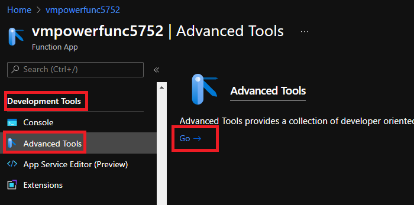  

Then we will navigate to `site -> wwwroot` and edit the `requirements.psd1` file to enable the AZ module:

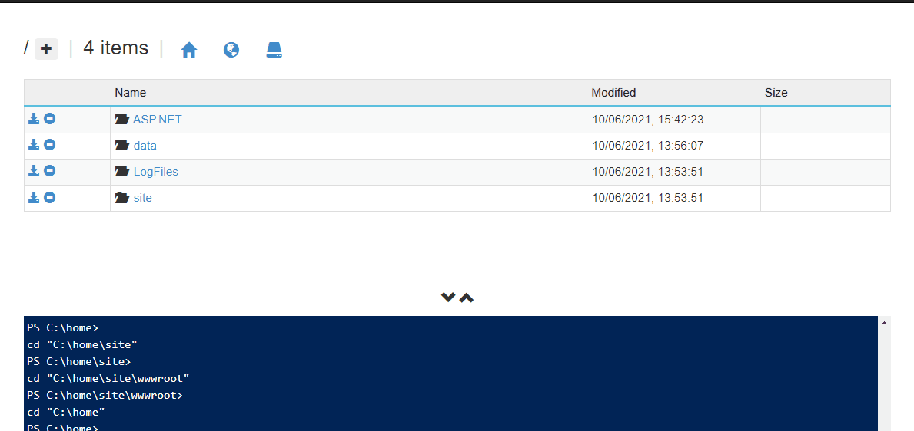  

**Note:** After this change we have to restart our function app.

Next we will create a proxy URL, copy the `Get function URL`:  

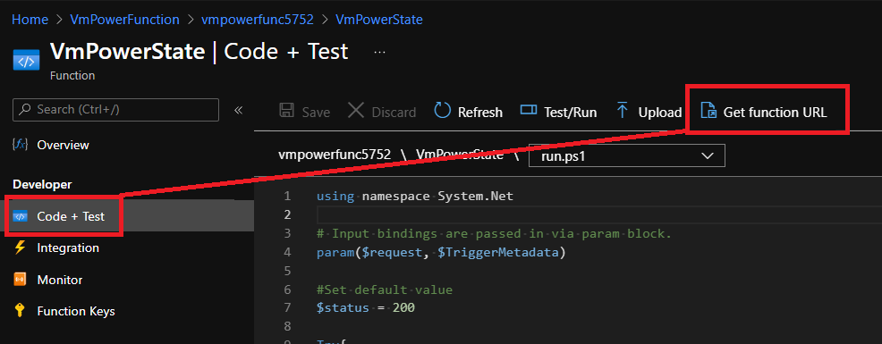  

Navigate back to the `Functions` pane and select `Proxies`, then select `Add` with the following settings:

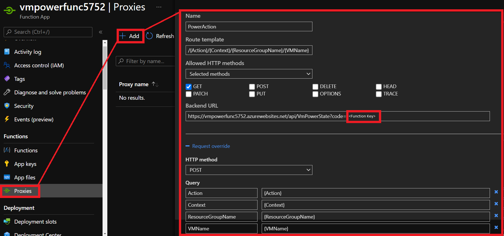

**Name:** `PowerAction`  
**Route template:** `/{Action}/{Context}/{ResourceGroupName}/{VMName}`  
**Allowed HTTP methods:** `GET`  
**Backend URL:** `<function URL>`  

**Request override**  
**HTTP method:** `POST`  

Add the following **Query** parameters:  

| Name              | Value               |
| ----------------- | ------------------- |
| Action            | {Action}            |
| Context           | {Context}           |
| ResourceGroupName | {ResourceGroupName} |
| VMName            | {VMName}            |

Now we can use a normal web browser to test our function app. Copy the proxy URL we just created:  
`https://functionappname.azurewebsites.net/{Action}/{Context}/{ResourceGroupName}/{VMName}`  
into a web browser and replace the query parameters with any of the following:  

`Action` = This value can be `stop`, `start` or `status`.  
`Context` = This value should be the subscription ID where our VMs reside and our function apps identity has permission.  
`ResourceGroupName` = This value should be the name of the resource group where the VMs reside.  
`VMName` = The name of our VM we want to perform action against.  

For example to check the `status` of a VM `MyWebServer01` you could put this in your browser:  
`https://functionappname.azurewebsites.net/status/259b6576-0000-0000-0000-000000000000/ResourceGroup223/MyWebServer01`  

To stop and de-allocate the VM `MyWevServer01` you could change the `{Action}` parameter to `stop`:  
`https://functionappname.azurewebsites.net/stop/259b6576-0000-0000-0000-000000000000/ResourceGroup223/MyWebServer01`  

Similarly you could also start a VM by changing the `{Action}` to `Start`

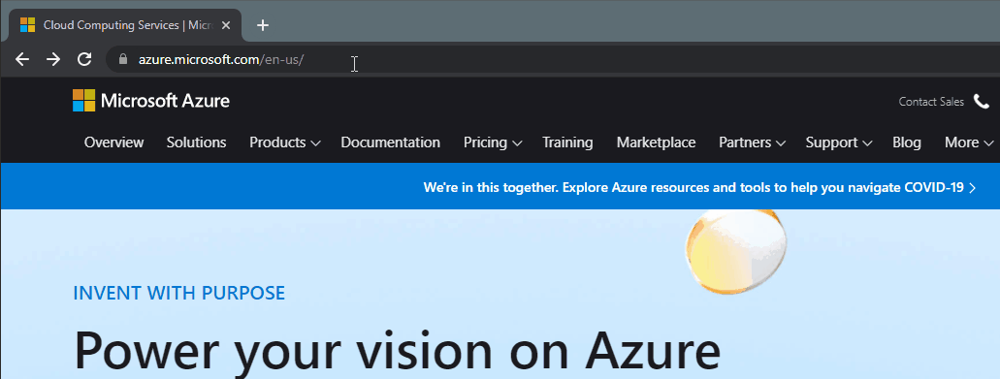

## Securing function apps

For the purposes of this tutorial be aware that the proxy URL we created to check the status, stop and start our VMs will be able to be run by anyone who knows the function app URL, subscription ID, Resource Group Name and VM Names. I would recommend securing the function app by following some of these [Function App Security recommendations](https://docs.microsoft.com/en-us/azure/architecture/serverless-quest/functions-app-security) as well as [Securing Azure Functions](https://docs.microsoft.com/en-us/azure/azure-functions/security-concepts)

A very quick and effective way as well to limit access to our URL is to only allow a specific IP or range of IPs to access our URL.  
You can navigate to the function app `settings` pane and select `Networking`:  

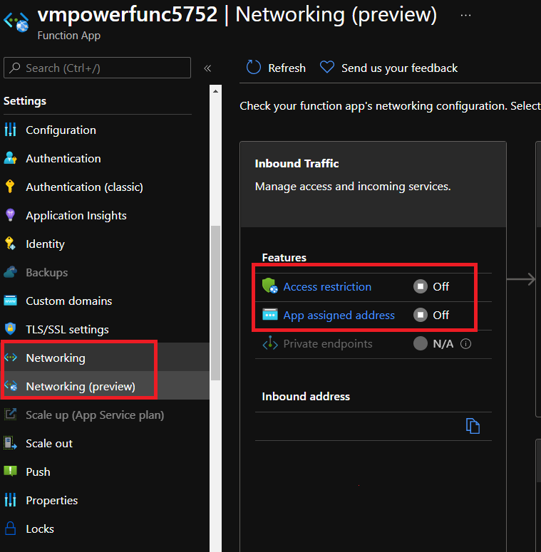  

Next select `Access Restrictions` and add a rule to allow your IP:

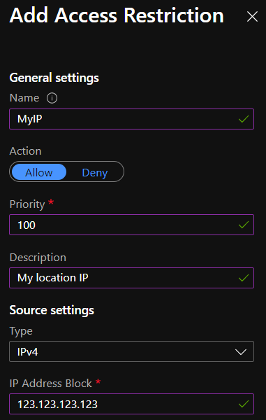  

By default this will block all inbound connections to our Proxy URL with the exception to our excluded IP. Now if anyone else tries to access the function they will be unable to.

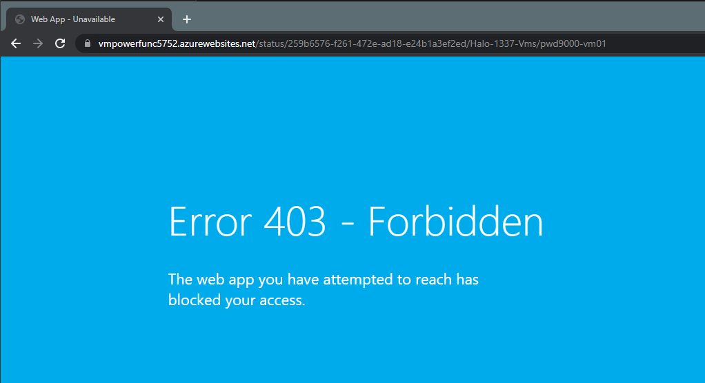  

I hope you have enjoyed this post and have learned something new. You can also find the code samples used in this blog post on my [Github](https://github.com/Pwd9000-ML/blog-devto/tree/master/posts/Azure-VM-Power-States-Function-App/code) :heart:

### _Author_

Marcel.L - pwd9000@hotmail.co.uk
