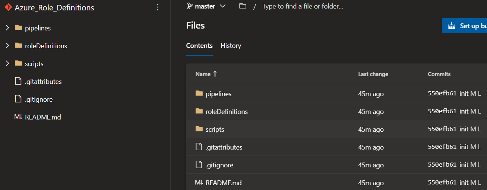

## What are Azure Roles and Custom Definitions?

When you start working more and more with Azure permission you will undoubtedly have used Azure RBAC (also known as IAM) and have most likely used some of the great [built-in roles](https://docs.microsoft.com/en-us/azure/role-based-access-control/built-in-roles) that have been created and provided by Microsoft, but sometimes you may come across a requirement or need to have a very specific role tailored with a set of permissions that are more granular than what comes out of the box in a standard Azure (RBAC) built-in role.  

Luckily Azure offers a great deal of flexibility when it comes to defining your own custom roles vs built-in roles. This is where [Custom Role Definitions](https://docs.microsoft.com/en-us/azure/role-based-access-control/role-definitions) comes into play.  

Today we will look at how we can utilize Azure DevOps in creating and also updating our Azure (RBAC) custom role definitions through source control and automatically reflecting those changes in Azure through pipelines without much effort. If you are still a bit unclear on what Azure RBAC is, or wanted more information have a look at [Microsoft Docs](https://docs.microsoft.com/en-us/azure/role-based-access-control/overview).

### How to automate Custom Role Definitions in Azure using DevOps

Firstly we will need to have an Azure DevOps repository where we can store our custom role definition JSON files.  
If you need more information on how to set up a new repository, have a look [here](https://docs.microsoft.com/en-us/azure/devops/repos/git/create-new-repo?view=azure-devops).  

In my repository I have created 3 main folder paths:


1. **pipelines:**
    Here we will define and create our Azure pipeline in yaml.

2. **roleDefinitions:**
    Here we will keep all our custom role definitions. We will also maintain this path when we need to make changes to any role definitions or create new ones.

3. **scripts:**
    Here we will keep a simple PowerShell script that will be used in our yaml pipeline.

Clone the newly set up repository and let's create our first role definition JSON file now. We will create a simple role definition JSON that will only allow resource health read permissions, because we want to give someone the ability to look at resource health within a subscription in our tenant.  
We will use this JSON template structure to build our definition:

```JSON
{
    "Name": "",
    "IsCustom": true,
    "Description": "",
    "Actions": [],
    "NotActions": [],
    "AssignableScopes": []
}
```

Our complete definition will look something like this:

```JSON
{
    "Name": "CUSTOM-RESOURCEHEALTH-Reader",
    "IsCustom": true,
    "Description": "Users with rights to only view Azure resource/service/subscription health.",
    "Actions": [
        "Microsoft.ResourceHealth/*/read"
    ],
    "NotActions": [],
    "AssignableScopes": [
        "/subscriptions/<subscriptioId1>"
    ]
}
```

**Note:** We can add more subscriptions to our assignable scopes or even use management groups if required. But for the purpose of this tutorial we only want to make the role available to a single Azure subscription. Other valuable links for reference when creating custom role definitions:  

* [Operations](https://docs.microsoft.com/en-us/azure/role-based-access-control/resource-provider-operations)
* [Operations format](https://docs.microsoft.com/en-us/azure/role-based-access-control/role-definitions#operations-format)
* [Assignable Scopes](https://docs.microsoft.com/en-us/azure/role-based-access-control/role-definitions#assignablescopes)

The next thing we will do is create our pipeline and script. In my repository I like to create a sub folder under `[pipelines]` called `[task_groups]`. This way I can easily break up my pipeline steps up into different task groups defined as `yaml templates`. Lets create the following `yaml` files in our repository.  

1. Under `[pipelines]` create the following YAML pipeline `[Rbac_Apply.yml]`:  

    This is going to be our main yaml pipeline: `[Rbac_Apply]`.  
    **Note:** The pipeline will only trigger on changes made to the repository path `[roleDefinitions/*]` and our `steps` will call our yaml templates created under `[task_groups]`.  

    ```YAML
    name: RBAC-Apply-$(Rev:rr)
    trigger:
    paths:
        include:
        - roleDefinitions/*

    stages:
    - stage: RBAC_Build
    displayName: RBAC Build
    jobs:
        - job: GET_Changed_Files
        displayName: GET Changed Files
        pool:
        name: AzurePipelines
        vmImage: windows-latest
        timeoutInMinutes: 30
        cancelTimeoutInMinutes: 5
        steps:
            - checkout: self
            - template: task_groups/get_changedfiles.yml
            - template: task_groups/set_rbac.yml 
    ```

2. Under `[pipelines]` create another folder called `[task groups]` and the following two YAML templates `[get_changedfiles.yml]` and `[set_rbac.yml]`:

    This is going to be our first task in our yaml pipeline: `[get_changedfiles.yml]`.  
    **Note:** This is a very basic inline powershell script task that will get the JSON files (in our case our custom role definitions) that have changed under the repository folder `[roleDefinitions/*]` it will create an array of all the changed files into an array and then dynamically create a pipeline variable called `roledefinitions`. Note that the array is converted into a string because our script we will be using in a later step will be written in PowerShell and will take the pipeline variable string as input. Since we are working with PowerShell we cannot define the DevOps pipeline variable of type `Array` that PowerShell will understand, so we convert the array into a string and then set that as a pipeline variable which will be consumed by our script.  

    ```YAML
    # 'get_changedfiles.yml' Determine which role definition files have changed
    steps:
    - task: PowerShell@2
    displayName: 'Get changed role definitions'
    inputs:
        targetType: inline
        script: |
        $editedFiles = git diff HEAD HEAD~ --name-only
        
        $resultArray = @()
        Foreach ($file in $editedFiles) {
            if ($file -like "roleDefinitions/*") {
            $filePath = "$(Build.SourcesDirectory)\$file"
            $resultArray += $filePath
            }
        }
        Write-Output "The following role definitions have been created / changed:"
        Write-Output "$resultArray"

        #Create a useable pipeline variable array to string that will be used in powershell script
        $psStringResult = @()
        $resultArray | ForEach-Object {
            $psStringResult += ('"' + $_.Split(',') + '"')
        }
        $psStringResult = "@(" + ($psStringResult -join ',') + ")"

        #Set VSO variable to use in powershell script as input
        Write-Output "##vso[task.setvariable variable=roledefinitions;]$psStringResult"

        Write-Output "Convert array to psString:"
        Write-Output $psStringResult
    ```

    This is going to be our second task in our yaml pipeline: `[set_rbac.yml]`.  
    **Note:** Remember in our first yaml task above we got all the JSON definitions that have changed or have been added and from that we created an array and converted that array into a string and set that as a pipeline variable called `$(roledefinitions)`. This task will now call our PowerShell script that we will create in the next step and pass the pipeline variable into our script as a parameter using `scriptArguments`. Also note that this task is an `AzurePowerShell` task and so we will also create a service connection (called `RbacServicePrincipal`) on our project so that our script can authenticate to Azure. We will also give that service connection the relevant `IAM` access to be able to execute the commands we will define in our script.

    ```YAML
    # 'set_rbac.yml' run our script that will amend/create the role definition in Azure
    steps:
    ### Run powershell to set or create new Az Role definitions
    - task: AzurePowerShell@5
    displayName: 'Update role definitions'
    inputs:
        azureSubscription: RbacServicePrincipal
        scriptType: filePath
        scriptPath: '.\scripts\Set-cisRbac.ps1'
        scriptArguments: '-RoleDefinitions $(roledefinitions)'
        azurePowerShellVersion: latestVersion
        errorActionPreference: silentlyContinue
    continueOnError: true
    ```

### _Author_

Marcel.L - pwd9000@hotmail.co.uk
