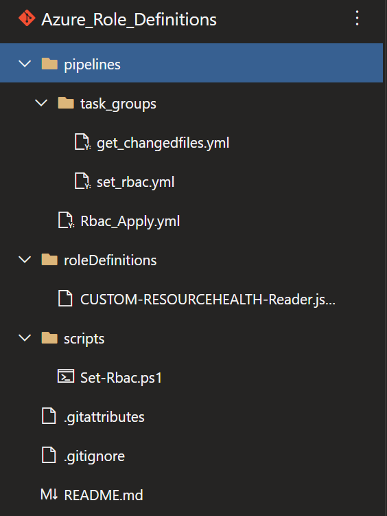
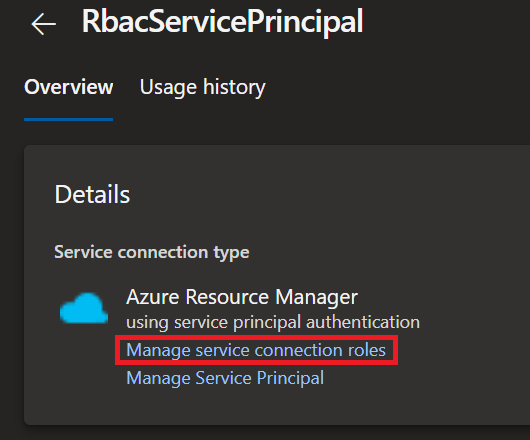
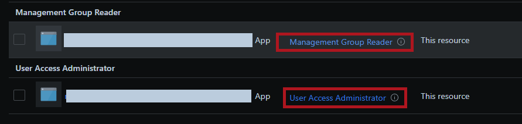
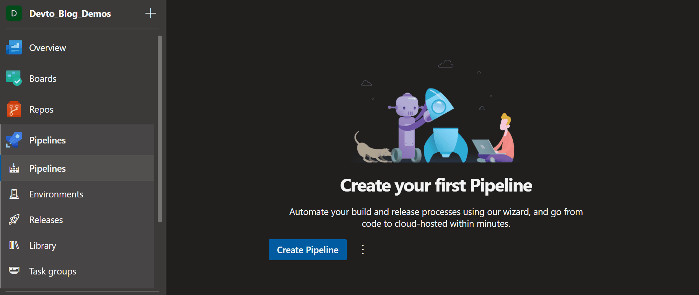
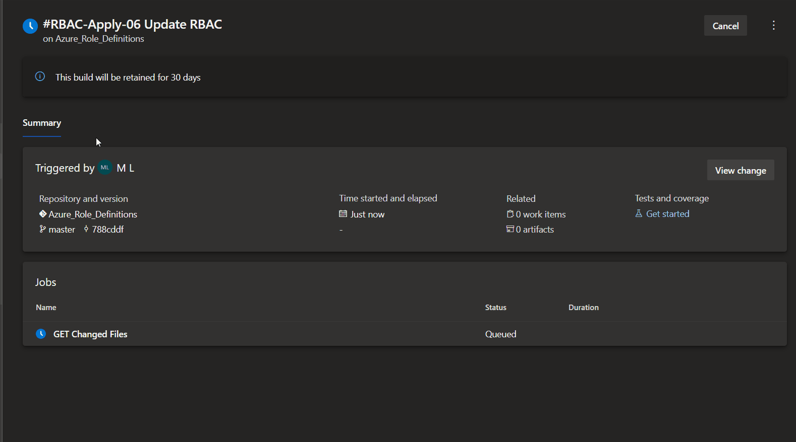
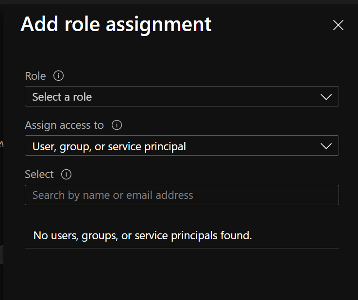

## What are Azure Roles and Custom Definitions?

When you start working more and more with Azure permissions you will undoubtedly have used Azure RBAC (also known as IAM) and have most likely used some of the great [built-in roles](https://docs.microsoft.com/en-us/azure/role-based-access-control/built-in-roles) that have been created and provided by Microsoft, but sometimes you may come across a requirement or a need to have a very specific role tailored with a set of permissions that are more granular than what comes out of the box in a standard Azure (RBAC) built-in role.

Luckily Azure offers a great deal of flexibility when it comes to defining your own custom roles vs built-in roles. This is where [Custom Role Definitions](https://docs.microsoft.com/en-us/azure/role-based-access-control/role-definitions) comes into play.

Today we will look at how we can utilize Azure DevOps in creating and also maintaining our Azure (RBAC) custom role definitions from an Azure DevOps repository through source control and automatically publishing those changes in Azure through a DevOps pipeline without much effort. If you are still a bit unclear on what Azure RBAC is, or wanted more information have a look at the [Microsoft Docs](https://docs.microsoft.com/en-us/azure/role-based-access-control/overview).

### How to automate Custom Role Definitions in Azure using DevOps

Firstly we will need to have an Azure DevOps repository where we can store our custom role definition JSON files. If you need more information on how to set up a new repository, have a look [here](https://docs.microsoft.com/en-us/azure/devops/repos/git/create-new-repo?view=azure-devops).

I called my repository `[Azure_Role_Definitions]`. In my repository I have created 3 main folder paths: 

1. **pipelines:** Here we will define and create our Azure yaml pipeline.

2. **roleDefinitions:** Here we will keep all our Azure custom role definition JSON files. This is also where we will maintain our custom role definitions when we need to make changes or even create new definitions we want to publish to Azure.

3. **scripts:** Here we will keep a simple PowerShell script that will be used in our yaml pipeline.

Clone this newly created or existing repository and let's get started to create our first role definition JSON file now. We will create a simple role definition JSON that will only allow resource health read permissions, because we want to give someone the ability to look at resource health within a subscription in our tenant.  
We will use the following JSON template structure to build our definition:

```JSON
{
    "Name": "",
    "IsCustom": true,
    "Description": "",
    "Actions": [],
    "NotActions": [],
    "AssignableScopes": []
}
```

Our complete definition will look something like below.  
**Note:** Change the `'AssignableScopes'` `/<subscriptionId1>` with the Id of your subscription you wish to publish this role on to.

```JSON
{
    "Name": "CUSTOM-RESOURCEHEALTH-Reader",
    "IsCustom": true,
    "Description": "Users with rights to only view Azure resource/service/subscription health.",
    "Actions": [
        "Microsoft.ResourceHealth/*/read"
    ],
    "NotActions": [],
    "AssignableScopes": [
        "/subscriptions/<subscriptioId1>"
    ]
}
```

**Note:** We can add more subscriptions to our assignable scopes or even use management groups if required. But for the purpose of this tutorial we only want to make the role available to a single Azure subscription. Here are a few more valuable links for reference when creating custom role definitions:

- [Operations](https://docs.microsoft.com/en-us/azure/role-based-access-control/resource-provider-operations)
- [Operations format](https://docs.microsoft.com/en-us/azure/role-based-access-control/role-definitions#operations-format)
- [Assignable Scopes](https://docs.microsoft.com/en-us/azure/role-based-access-control/role-definitions#assignablescopes)

The next thing we will do is create our pipeline and script. In my repository I like to create a sub folder under `[pipelines]` called `[task_groups]`. This way I can easily break my pipeline steps up into different task groups defined as `yaml templates`. Lets create the following `yaml` files in our repository.

1. Under `[pipelines]` create the following YAML pipeline `[Rbac_Apply.yml]`:

   This is going to be our main yaml pipeline called: `[Rbac_Apply]`.  
   **Note:** The pipeline will only trigger on changes made to the repository path `[roleDefinitions/*]` and our `steps` will call our yaml templates created under `[task_groups]`.

   ```YAML
   # 'pipelines/Rbac_Apply.yml'
   name: RBAC-Apply-$(Rev:rr)
   trigger:
   paths:
       include:
       - roleDefinitions/*

   stages:
   - stage: RBAC_Build
   displayName: RBAC Build
   jobs:
       - job: GET_Changed_Files
       displayName: GET Changed Files
       pool:
       name: Azure Pipelines
       vmImage: windows-latest
       timeoutInMinutes: 30
       cancelTimeoutInMinutes: 5
       steps:
           - checkout: self
           - template: task_groups/get_changedfiles.yml
           - template: task_groups/set_rbac.yml
   ```

2. Under `[pipelines]` create another folder called `[task groups]` and the following two YAML templates `[get_changedfiles.yml]` and `[set_rbac.yml]`:

   This is going to be our first task in our yaml pipeline: `[get_changedfiles.yml]`.  
   **Note:** This is a basic inline powershell script task that will get the JSON files (in our case our custom role definitions) that have changed under the repository folder `[roleDefinitions/*]`. It will create an array of all the files that have changed or have been added to the repository path and then dynamically create a pipeline variable called `'roledefinitions'`. Note that the array is converted into a string because our script we will be using in a later step will be written in PowerShell and will take the pipeline variable string as input. Since we are working with PowerShell we cannot define the DevOps pipeline variable of type `'Array'` that PowerShell will understand, so we convert the `'array'` into a `'string'` and then set that as a pipeline variable which will be consumed by our script.

   ```YAML
   # 'pipelines/task_groups/get_changedfiles.yml' Determine which role definition files have changed
   steps:
   - task: PowerShell@2
   displayName: 'Get changed role definitions'
   inputs:
       targetType: inline
       script: |
       $editedFiles = git diff HEAD HEAD~ --name-only

       $resultArray = @()
       Foreach ($file in $editedFiles) {
           if ($file -like "roleDefinitions/*") {
           $filePath = "$(Build.SourcesDirectory)\$file"
           $resultArray += $filePath
           }
       }
       Write-Output "The following role definitions have been created / changed:"
       Write-Output "$resultArray"

       #Create a useable pipeline variable array to string that will be used in powershell script
       $psStringResult = @()
       $resultArray | ForEach-Object {
           $psStringResult += ('"' + $_.Split(',') + '"')
       }
       $psStringResult = "@(" + ($psStringResult -join ',') + ")"

       #Set VSO variable to use in powershell script as input
       Write-Output "##vso[task.setvariable variable=roledefinitions;]$psStringResult"

       Write-Output "Convert array to psString:"
       Write-Output $psStringResult
   ```

   Now for the second task in our yaml pipeline: `[set_rbac.yml]`.  
   **Note:** Remember in our first yaml task above we got all the JSON definitions that have changed or have been added and from that we created an array and converted that array into a string and set that as a pipeline variable called `$(roledefinitions)`. This next task will call our PowerShell script that we will create in the next step and pass the pipeline variable into our script as a parameter using `'scriptArguments'`. Also note that this task is an `'AzurePowerShell'` task and so we will also create a service connection (called `RbacServicePrincipal`) on our DevOps project so that our script can authenticate to Azure. We will also give that service connection service principal the relevant `'IAM'` access to be able to execute the commands we will define in our script.

   ```YAML
   # 'pipelines/task_groups/set_rbac.yml' run our script that will amend/create the role definition in Azure
   steps:
   ### Run powershell to set or create new Az Role definitions
   - task: AzurePowerShell@5
   displayName: 'Update role definitions'
   inputs:
       azureSubscription: RbacServicePrincipal
       scriptType: filePath
       scriptPath: '.\scripts\Set-Rbac.ps1'
       scriptArguments: '-RoleDefinitions $(roledefinitions)'
       azurePowerShellVersion: latestVersion
       errorActionPreference: silentlyContinue
   continueOnError: true
   ```

Now under our repository folder path `[scripts]` we will create a PowerShell script called `[Set-Rbac.ps1]`.  
**Note:** This powershell script calls cmdlets from the AZ module, so if a self-hosted DevOps agent is used instead of a Microsoft hosted agent, please ensure that the AZ module is installed and configured on your DevOps agent or pool of agents. The below script may be amended to suit your environment better if you use deeply nested management groups. What the script below does is read in each JSON role definition and then sets the context to one of the subscriptions defined in the JSON file `'AssignableScopes'`. Once in the context of a subscription, the script will evaluate whether a Custom Role Definition already exists in the context of the subscription, if it does the script will update the role definition with any changes or if the role does not exist it will be created.

```powershell
# 'scrips/set_rbac.ps1'
#Parameters from pipeline
Param (
 [Parameter(Mandatory)]
 [array]$RoleDefinitions
)

#Directory in use.
Write-host "Current Scripting directory: [$PSScriptRoot]"

#checked out build sources path
$BuildSourcesDirectory = "$(Resolve-Path -Path $PSScriptRoot\..)"
Write-host "Current checked out build sources directory: [$BuildSourcesDirectory]"

Foreach ($file in $RoleDefinitions) {
    $Obj = Get-Content -Path $file| ConvertFrom-Json
    $scope = $Obj.AssignableScopes[0]

    If ($scope -like "*managementGroups*") {
        $managementGroupSubs = ((Get-AzManagementGroup -GroupId ($scope | Split-Path -leaf) -Expand -Recurse).Children)
        If ($managementGroupSubs.Type -like "*managementGroups") {
            Set-AzContext -SubscriptionId $managementGroupSubs.children[0].Name
        }
        If ($managementGroupSubs.Type -like "*subscriptions") {
            Set-AzContext -SubscriptionId $managementGroupSubs.Name[0]
        }

        #Test if roledef exists
        $roleDef = Get-AzRoleDefinition $Obj.Name
        If ($roleDef) {
            Write-Output "Role Definition [$($Obj.name)] already exists:"
            Write-Output "----------------------------------------------"
            $roleDef
            Write-Output "----------------------------------------------"
            Write-Output "Updating Azure Role definition"

            Set-AzRoleDefinition -InputFile $file
        }
        Else {
            Write-Output "Role Definition does not exist:"
            Write-Output "Creating new Azure Role definition"

            New-AzRoleDefinition -InputFile $file
        }
    }

    If ($scope -like "*subscriptions*") {
        Set-AzContext -SubscriptionId ($scope | Split-Path -leaf)

        #Test if roledef exists
        $roleDef = Get-AzRoleDefinition $Obj.Name
        If ($roleDef) {
            Write-Output "Role Definition [$($Obj.name)] already exists:"
            Write-Output "----------------------------------------------"
            $roleDef
            Write-Output "----------------------------------------------"
            Write-Output "Updating Azure Role definition"

            Set-AzRoleDefinition -InputFile $file
        }
        Else {
            Write-Output "Role Definition does not exist:"
            Write-Output "Creating new Azure Role definition"

            New-AzRoleDefinition -InputFile $file
        }
    }
}
```

Our repository should now look something like this:  


Now on to the last step. Since our script needs to run and perform tasks in Azure we will create a service connection called `'RbacServicePrincipal'` and we will also give the principal we create access in IAM to be able to perform it's tasks. Follow these steps to [create an Azure DevOps Service Connection](https://docs.microsoft.com/en-us/azure/devops/pipelines/library/service-endpoints?view=azure-devops&tabs=yaml).  
Ensure you name the service connection the same as what we defined in our Yaml task `[set_rbac.yml]`, namely `'RbacServicePrincipal'`. After the service connection is created we will slightly change the IAM permissions given to the principal to give it only the permissions it requires. So under the DevOps project settings, go to `'Service Connections'` and then select `'Manage Service Connection Roles'`.



By default the service connection will be assigned the built-in role of `'Contributor'`. This permission is excessive and can be removed. Since our pipeline script only needs to be able to look at management groups and be able to change context as well as be able to create or amend role definitions we will give our service connection principal the following built-in roles at the scope we want to maintain: `'Management Group Reader'` and `'User Access Administrator'`



Now we can create our pipeline in DevOps from the yaml file we defined earlier in this post:



Next we authorize our pipeline and that's it, now each time a new JSON definition is added or an existing definition is amended on our repository the change will auto-magically be reflected in Azure and we can now use proper version control and automation around governing our Azure RBAC custom role definitions using Azure DevOps.



We can also confirm that our role is now published and usable in Azure. :smile:



I hope you have enjoyed this post and have learned something new.  
You can also find the code samples used in this blog post on this [Github](https://github.com/Pwd9000-ML/blog-devto/tree/master/posts/DevOps-Automate-Azure-RBAC/code) page. :heart:  

### _Author_

Marcel.L - pwd9000@hotmail.co.uk
