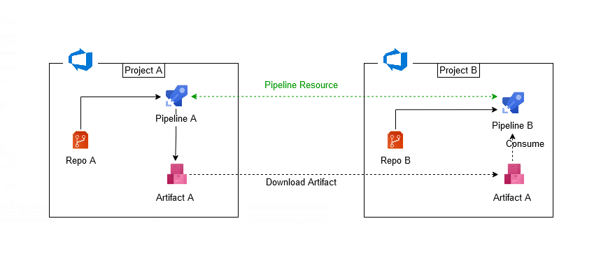

## Azure DevOps pipeline/YAML resources

Azure DevOps pipelines provides very useful [resources](https://docs.microsoft.com/en-us/azure/devops/pipelines/process/resources?view=azure-devops&tabs=schema) we can define in our pipeline in one place and be consumed anywhere in our pipeline.  

A resource is anything used by a pipeline that lives outside the pipeline. Pipeline resources include:

- CI/CD pipelines that produce artifacts (Azure Pipelines, Jenkins, etc.)
- code repositories (Azure Repos Git repos, GitHub, GitHub Enterprise, Bitbucket Cloud)
- container image registries (Azure Container Registry, Docker Hub, etc.)
- package feeds (GitHub packages)

Today we will take a look at the [Pipelines Resource](https://docs.microsoft.com/en-us/azure/devops/pipelines/process/resources?view=azure-devops&tabs=schema#resources-pipelines), in particular we will look at how we can use this resource in a pipeline to consume an artifact that was produced in another pipeline in a completely different project.

## Consume remote pipeline artifacts

In my DevOps organisation I have created two projects namely **ProjectA** and **ProjectB**. I also created two YAML pipelines for each corresponding project named **PipelineA** and **PipelineB**. **PipelineA** will be my triggering/source pipeline which will create an artifact called **ArtifactA**. **PipelineB** will be my pipeline which will contain the pipeline resource for **PipelineA** and will consume **ArtifactA**.

In **ProjectA** I also created **RepoA** which contains a file called **MyConfig.txt**.

