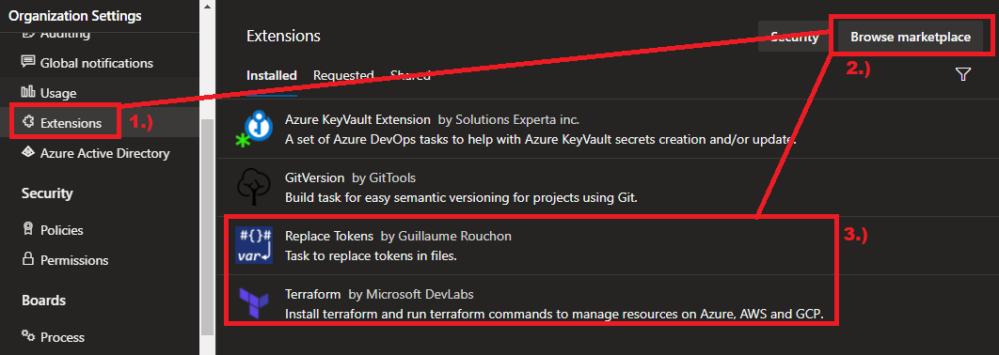

## Replace tokens

Replace tokens is a DevOps extension that can be installed into your DevOps Organisation from the Azure DevOps [marketplace](https://marketplace.visualstudio.com/items?itemName=qetza.replacetokens), simply put it is an Azure Pipelines extension that replace tokens in files with variable values. Today we will look at how we can use this Devops extension working with a terraform HCL code base, to dynamically deploy terraform environments.

## Installing Replace Tokens

Before we can use replace tokens we have to install it into our Devops Organisation from the [marketplace](https://marketplace.visualstudio.com/items?itemName=qetza.replacetokens).  

Go to your DevOps Organisation Settings and select the **Extensions** tab followed by **Browse marketplace** and search for **Replace tokens**. In addition we will also install the terraform extension called **Terraform** by Microsoft DevLabs.

## Project layout

For this tutorial I have set up a new project in my organisation called **DynamicTerraform**, I also created a repository called **Infrastructure**. inside of my repository I have created  

I hope you have enjoyed this post and have learned something new. You can also find the code samples used in this blog post on my [Github](https://github.com/Pwd9000-ML/blog-devto/tree/master/posts/DevOps-Replace-Tokens/code) page. :heart:

### _Author_


