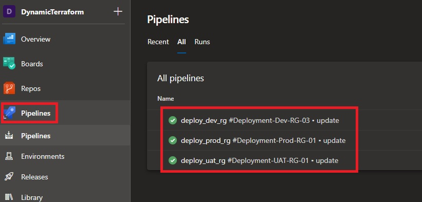
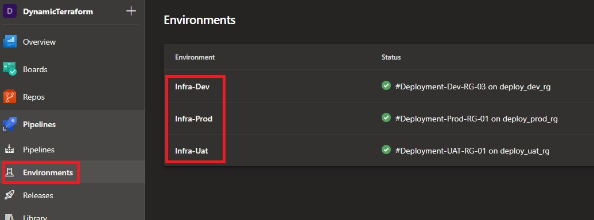
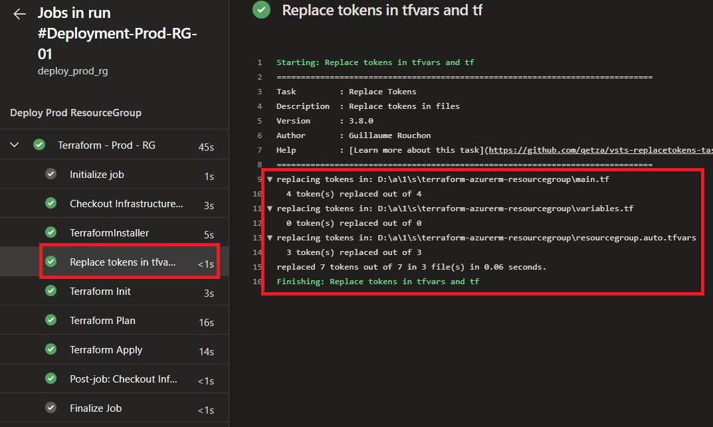
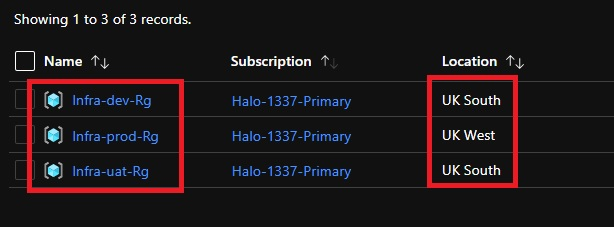
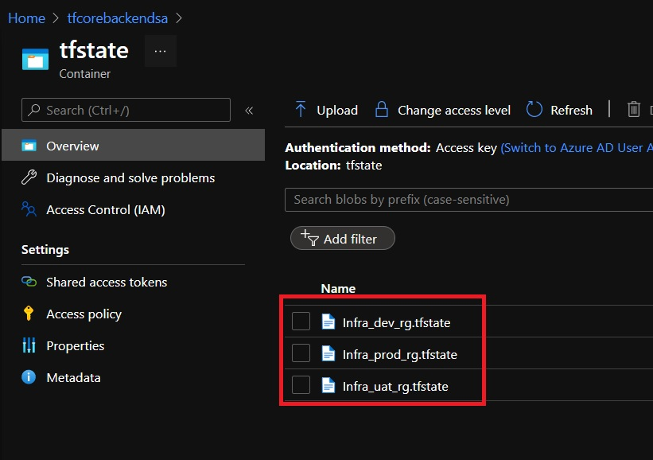

## Replace tokens

Replace tokens is a DevOps extension that can be installed into your DevOps Organisation from the Azure DevOps [marketplace](https://marketplace.visualstudio.com/items?itemName=qetza.replacetokens), simply put it is an Azure Pipelines extension that replace tokens in files with variable values. Today we will look at how we can use this Devops extension working with a terraform HCL code base, to dynamically deploy infrastructure hosted on Azure based on environments defined as variables in DevOps using terraform.

## Installing Replace Tokens

Before we can use replace tokens we have to install it into our Devops Organisation from the [marketplace](https://marketplace.visualstudio.com/items?itemName=qetza.replacetokens).  

Go to DevOps Organisation Settings and select the **Extensions** tab followed by **Browse marketplace** and search for **Replace tokens**. In addition also install the terraform extension called **Terraform** by Microsoft DevLabs as we will use this later on to use terraform tasks in our DevOps pipeline.


## Project layout and objective

For this tutorial we will write a simple terraform configuration that will deploy a resource group, but we will use the **replace tokens task** to manipulate our configuration file to deploy 3 different resource groups based on environment. For example `Infra-dev-Rg`, `Infra-uat-Rg` and `Infra-prod-Rg`. I have set up a new project in my organisation called **DynamicTerraform**, I also created a repository called **Infrastructure**. Inside of my repository I have created the following paths:

- `\terraform-azurerm-resourcegroup` This location will be my root path used to store the main terraform configuration files which will be used to deploy a simple resource group.
- `\terraform-azurerm-resourcegroup\pipelines` This location will be used to store and configure yaml deployment pipelines for the resources in my root path.
- `\terraform-azurerm-resourcegroup\pipelines\variables` This location will be used to store and configure yaml variable template files used for my pipelines.

Any additional future resources can be created in new root paths e.g.: `\terraform-azurerm-resourceX`, `\terraform-azurerm-resourceY`, `\terraform-azurerm-resourceZ` etc... For this tutorial we will just be using `\terraform-azurerm-resourcegroup` to deploy a simple resource groups dynamically based on environments for `dev`, `uat` and `prod`.


## Terraform Configuration

As a pre-req I have also pre-created an Azure DevOps [service connection](https://docs.microsoft.com/en-us/azure/devops/pipelines/library/service-endpoints?view=azure-devops&tabs=yaml#create-a-service-connection) that will be used to allow my pipelines to access Azure via the terraform task we installed earlier, and I also pre-created an Azure storage account which will act as my terraform [backend](https://www.terraform.io/docs/language/settings/backends/azurerm.html) to safely store my terraform state files in.  

Under my repo path: `\terraform-azurerm-resourcegroup\`, I have created the following three terraform files:

1. main.tf

    ```hcl
    ##################################################
    # Terraform Config                               #
    ##################################################
    terraform {
      required_version = ">= ~{terraformVersion}~"

      backend "azurerm" {
        resource_group_name  = "~{terraformBackendRG}~"
        storage_account_name = "~{terraformBackendSA}~"
        container_name       = "tfstate"
        key                  = "infra_~{environment}~_rg.tfstate"
      }

      required_providers {
        azurerm = {
        source  = "hashicorp/azurerm"
        version = "~> 2.73"
        }
      }
    }

    provider "azurerm" {
      features {}
      skip_provider_registration = true
    }

    ##################################################
    # RESOURCES                                      #
    ##################################################
    resource "azurerm_resource_group" "resource_group" {
      name     = var.resource_group_name
      location = var.location
      tags     = var.tags
    }
    ```

    **NOTE:** If you look at the our terraform configuration you will notice the following: `~{terraformVersion}~`, `~{terraformBackendRG}~`, `~{terraformBackendSA}~` and `~{environment}~`, we will be dynamically changing the values inside of `~{ }~` with values from our pipeline variable file later on in this tutorial using **replace tokens**.

2. variables.tf

    ```hcl
    variable "resource_group_name" {
      type        = string
      description = "Specifies the name of the resource group that will be created."
    }

    variable "location" {
      type        = string
      description = "The location/region where Azure resource will be created."
    }

    variable "tags" {
      type        = map(any)
      description = "Specifies a map of tags to be applied to the resources created."
    }
    ```

3. resourcegroup.auto.tfvars

    ```hcl
    resource_group_name = "Infra-~{environment}~-Rg"
    location            = "~{location}~"
    tags = {
      terraformDeployment = "true"
      Environment         = "~{environment}~"
    }
    ```

    **NOTE:** Again, if you look at the our **tfvars** configuration you will notice the following: `~{environment}~` and `~{location}~`, we will be dynamically changing the values inside of `~{ }~` with values from our pipeline variable file later on in this tutorial using **replace tokens**.

## DevOps Pipeline Variable file

Under my repo path: `\pipelines\variables`, I have created the following four yaml variable template files:

1. common_vars.yml - Will be used in all pipelines.

    ```yml
    variables:
    #Terraform Config + backend
      - name: terraformVersion
        value: "1.0.5"

      - name: terraformBackendRG
        value: "TF-Core-Rg"

      - name: terraformBackendSA
        value: "tfcorebackendsa"

    #Variables used for SSH connectivity to DevOps
      - name: sshKeySecureFile
        value: "sshKeySecureFile"

      - name: sshKvName
        value: "tf-devops-kv"

      - name: sshKv_service_connection_name
        value: "TF-Terraform-SP"
    ```

2. dev_vars.yml - Will be used in DEV specific pipeline.

    ```yml
    variables:
    #Development Variables
      - name: environment
        value: "dev"

      - name: location
        value: "uksouth"
    ```

3. uat_vars.yml - Will be used in UAT specific pipeline.

    ```yml
    variables:
    #UAT Variables
      - name: environment
        value: "uat"

      - name: location
        value: "uksouth"
    ```

4. prod_vars.yml - Will be used in PROD specific pipeline.

    ```yml
    variables:
    #Production Variables
      - name: environment
        value: "prod"

      - name: location
        value: "ukwest"
    ```

**NOTE:** You will notice that my variable **names** in each yaml template are aligned with the values I used on my terraform configuration files: `~{environment}~`, `~{location}~`, `~{terraformBackendRG}~`, `~{terraformBackendSA}~`. Also note that our production variable file has a different location specified `ukwest`.

## DevOps Pipeline

Under my repo path: `\pipelines`, I have created the following three yaml pipelines:

1. dev_deployment.yml

    ```yml
    ```

2. uat_deployment.yml

    ```yml
    ```

3. prod_deployment.yml

    ```yml
    ```

Now we can set up each pipeline, which will consume its corresponding variable template file and use the same terraform code to dynamically deploy the same resource group but each having its own state file, name and tags.



Also remember to set the environments as shown on each of our yaml pipelines:

```yml code
```



After each pipeline has run, you will otice that our terraform confiuratn was dynamically changed each time with replace okens replacing the values on our TF and TFVARS files.



You can also see the each resource group have been dynamically created.



**NOTE:** Remember we changed prod to be in the UK West region on our variable template file for prod earlier.

Also note that each of my deployments have a unique state file based on the environment as depicted on each of my yaml pipelines:

```yaml
```



I hope you have enjoyed this post and have learned something new. You can also find the code samples used in this blog post on my [Github](https://github.com/Pwd9000-ML/blog-devto/tree/master/posts/DevOps-Replace-Tokens/code) page. :heart:

### _Author_


