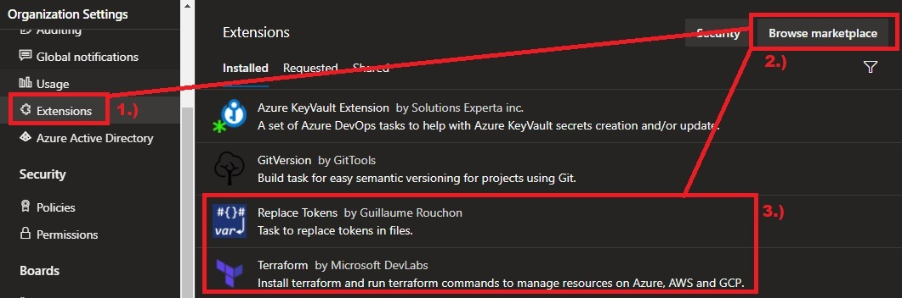

## Replace tokens

Replace tokens is a DevOps extension that can be installed into your DevOps Organisation from the Azure DevOps [marketplace](https://marketplace.visualstudio.com/items?itemName=qetza.replacetokens), simply put it is an Azure Pipelines extension that replace tokens in files with variable values. Today we will look at how we can use this Devops extension working with a terraform HCL code base, to dynamically deploy infrastructure hosted on Azure based on environments defined as variables in DevOps using terraform.

## Installing Replace Tokens

Before we can use replace tokens we have to install it into our Devops Organisation from the [marketplace](https://marketplace.visualstudio.com/items?itemName=qetza.replacetokens).  

Go to DevOps Organisation Settings and select the **Extensions** tab followed by **Browse marketplace** and search for **Replace tokens**. In addition also install the terraform extension called **Terraform** by Microsoft DevLabs as we will use this later on to use terraform tasks in our DevOps pipeline.



## Project layout and objective

For this tutorial we will write a simple terraform configuration that will deploy a resource group, but we will use the **replace tokens task** to manipulate our configuration file to deploy 3 different resource groups based on environment. For example `Infra-dev-Rg`, `Infra-uat-Rg` and `Infra-prod-Rg`. I have set up a new project in my organisation called **DynamicTerraform**, I also created a repository called **Infrastructure**. Inside of my repository I have created the following paths:

- `\terraform-azurerm-resourcegroup` This location will be my root path used to store the main terraform configuration files which will be used to deploy a simple resource group.
- `\terraform-azurerm-resourcegroup\pipelines` This location will be used to store and configure yaml deployment pipelines for the resources in my root path.
- `\terraform-azurerm-resourcegroup\pipelines\variables` This location will be used to store and configure yaml variable template files used for my pipelines.

Any additional future resources can be created in new root paths e.g.: `\terraform-azurerm-resourceX`, `\terraform-azurerm-resourceY`, `\terraform-azurerm-resourceZ` etc... For this tutorial we will just be using `\terraform-azurerm-resourcegroup` to deploy a simple resource groups dynamically based on environments for `dev`, `uat` and `prod`.


## Terraform Configuration

As a pre-req I have also pre-created an Azure DevOps [service connection](https://docs.microsoft.com/en-us/azure/devops/pipelines/library/service-endpoints?view=azure-devops&tabs=yaml#create-a-service-connection) that will be used to allow my pipelines to access Azure via the terraform task we installed earlier, and I also pre-created an Azure storage account which will act as my terraform [backend](https://www.terraform.io/docs/language/settings/backends/azurerm.html) to safely store my terraform state files in.  

Under my repo path: `\terraform-azurerm-resourcegroup\`, I have created the following three terraform files:

1. **main.tf** (Main terraform configuration file)

    ```txt
    // code/terraform-azurerm-resourcegroup/main.tf
    ```

    **NOTE:** If you look at the our terraform configuration you will notice the following values: `~{terraformVersion}~`, `~{terraformBackendRG}~`, `~{terraformBackendSA}~` and `~{environment}~`, we will be dynamically changing the values inside of `~{ }~` with values from our pipeline variable file later on in this tutorial using **replace tokens**.

2. **variables.tf** (Terraform variable definition file)

    ```txt
    // code/terraform-azurerm-resourcegroup/variables.tf
    ```

3. **resourcegroup.auto.tfvars** (Terraform variables which will be dynamically changed by replace tokens task)

    ```txt
    // code/terraform-azurerm-resourcegroup/resourcegroup.auto.tfvars
    ```

    **NOTE:** Again, if you look at the our **TFVARS** configuration file you will notice the following values: `~{environment}~` and `~{location}~`, we will be dynamically changing the values inside of `~{ }~` with values from our pipeline variable file later on in this tutorial using **replace tokens**.

## DevOps Pipeline Variable file

Under my repo path: `\terraform-azurerm-resourcegroup\pipelines\variables`, I have created the following four yaml variable template files:

1. **common_vars.yml** (Declares variables that will be used in all pipelines).

    ```txt
    // code/terraform-azurerm-resourcegroup/pipelines/variables/common_vars.yml
    ```

2. **dev_vars.yml** (Declares variables that will be used in DEV specific pipeline).

    ```txt
    // code/terraform-azurerm-resourcegroup/pipelines/variables/dev_vars.yml
    ```

3. **uat_vars.yml** (Declares variables that will be used in UAT specific pipeline).

    ```txt
    // code/terraform-azurerm-resourcegroup/pipelines/variables/uat_vars.yml
    ```

4. **prod_vars.yml** (Declares variables that will be used in PROD specific pipeline).

    ```txt
    // code/terraform-azurerm-resourcegroup/pipelines/variables/prod_vars.yml
    ```

**NOTE:** You will notice that the variable **names** in each yaml template are aligned with the values used on the terraform configuration files earlier: `~{environment}~`, `~{location}~`, `~{terraformBackendRG}~`, `~{terraformBackendSA}~`. Also note that our production variable file has a different location specified: `ukwest`.

