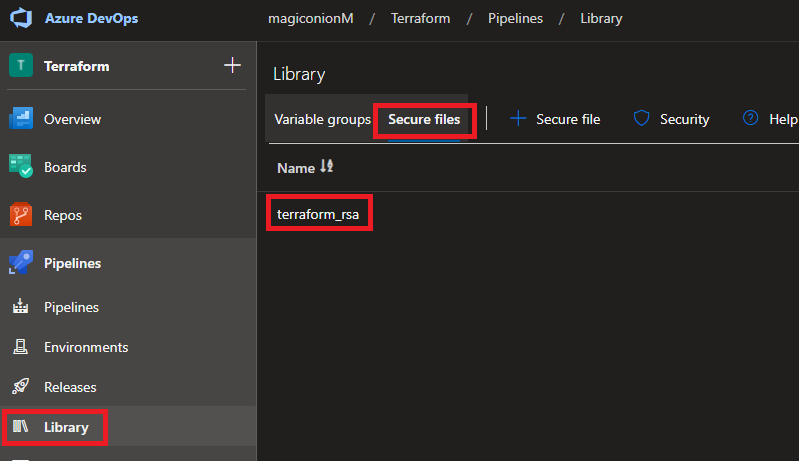
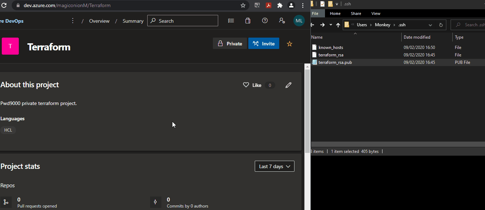

## Terraform module sources?

Terraform supports many different [Module Sources](https://www.terraform.io/docs/language/modules/sources.html). In todays tutorial we look at how we can configure an Azure DevOps repo with SSH and use this repo as a module source in terraform. We will also create a DevOps pipeline that will trigger a basic terraform deployment using a Azure DevOps repo as source and connect to it over SSH.

## Step 1: Prepare SSH Key

First we have to create a SSH key pair:  

1. Install Git for windows.
2. In a powershell console run: `ssh-keygen`. This will create a private key: `id_rsa` and a public key: `id_rsa.pub` under the following path: `%UserProfile%/.ssh`.
3. If a passphrase was used in the creation of the key pair, make a note of the passphrase as we will need it later on.
4. Next run: `ssh-keyscan -H -t rsa ssh.dev.azure.com > $env:userprofile/.ssh/known_hosts`. The content of the file will be used later on in the setup of the [Install SSH Key](https://github.com/MicrosoftDocs/azure-devops-docs/blob/master/docs/pipelines/tasks/utility/install-ssh-key.md) devops task in our DevOps pipeline.


## Step 2: Prepare Azure Devops

1. Copy the private key file created in the previous step `id_rsa` into azure **pipelines -> Library -> Secure files**. The file can be renamed to make it more friendly to use later on in the [Install SSH Key](https://github.com/MicrosoftDocs/azure-devops-docs/blob/master/docs/pipelines/tasks/utility/install-ssh-key.md) devops task. In my case I have renamed my private key to `terraform_rsa`.

    

2. Under the **user settings** in Azure Devops go to SSH public keys and select **Add**. Give a description and add the contents of the file created `id_rsa.pub`. In my case I have renamed my public key to `terraform_rsa.pub`.

    

## Step 3: How to use _Install SSH Key_ devops task in a pipeline

If you are using an Azure DevOps pipeline to execute terraform from a Devops agent and that terraform code is referencing an Azure Devops git Repo, we can now make use of the [Install SSH Key](https://github.com/MicrosoftDocs/azure-devops-docs/blob/master/docs/pipelines/tasks/utility/install-ssh-key.md) devops task to install the SSH key onto the DevOps agent that will be running executing the terraform code that is referencing the Azure Devops repo as a source.  

We will create a few variables next. These variables can either be created inside of a [variable group](https://docs.microsoft.com/en-us/azure/devops/pipelines/library/variable-groups?view=azure-devops&tabs=yaml#use-a-variable-group) or a [keyvault](https://docs.microsoft.com/en-us/azure/key-vault/general/overview) and accessed using the [Azure key vault task](https://docs.microsoft.com/en-us/azure/devops/pipelines/release/azure-key-vault?view=azure-devops) in our devops pipeline.

1. Create a variable in azure devops pipeline `git_ssh_pub` and add the content of file (id_rsa.pub). This can also be stored as a secret instead in Azure key vault and accessed via the **_azure key vault_** [devops task](https://docs.microsoft.com/en-us/azure/devops/pipelines/release/azure-key-vault?view=azure-devops).
2. Create a variable in azure devops pipeline `git_ssh_known_hosts` and add the content of file (known_hosts) created above with `ssh-keyscan`. This can also be stored as a secret instead in Azure key vault and accessed via the **_azure key vault_** [devops task](https://docs.microsoft.com/en-us/azure/devops/pipelines/release/azure-key-vault?view=azure-devops).
3. (Optional) If a passphrase was used in the generation of the ssh key pair in step one, you can create a variable in the azure devops pipeline `git_ssh_pass` and add the secret value. This can also be stored as a secret instead in Azure key vault and accessed via the **_azure key vault_** [devops task](https://docs.microsoft.com/en-us/azure/devops/pipelines/release/azure-key-vault?view=azure-devops).
4. Create the [Install SSH Key](https://github.com/MicrosoftDocs/azure-devops-docs/blob/master/docs/pipelines/tasks/utility/install-ssh-key.md) devops task and use the following parameters:

- Display Name: Install an SSH key
- Known Hosts Entry: $(git_ssh_known_hosts)
- SSH Public Key: $(git_ssh_pub)
- Passphrase: [none] (if no passphrase was generated in ssh key pair generation or [$(git_ssh_pass)] if a password was used)
- SSH Key: id_rsa (This was the private key we uploaded into secure files library)

Thats it, the [Install SSH Key](https://github.com/MicrosoftDocs/azure-devops-docs/blob/master/docs/pipelines/tasks/utility/install-ssh-key.md) Devops task will now install and set the SSH up on the ADO agent to connect securely to AzureDevOps git repo where our terraform module code is kept.

### Devops Yaml pipeline example

Here is a basic yaml pipeline example of the tasks/steps to read in secrets as variables from key vault and also including **install SSH keys** task.

```yaml
todo
```

### Terraform source module example

```hcl
module "terraform_aws_eks" {

  source = "git::git@ssh.dev.azure.com:v3/Org/Project/repo"
  
}
```

### _Author_

Marcel.L - pwd9000@hotmail.co.uk
