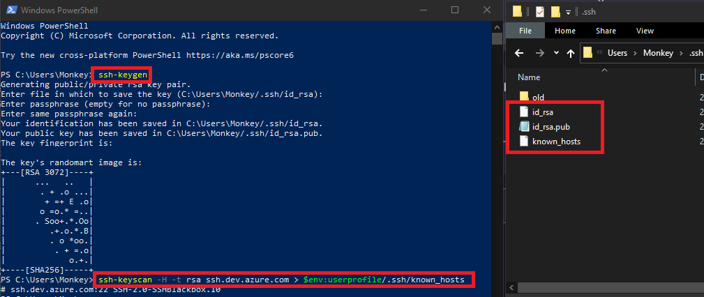
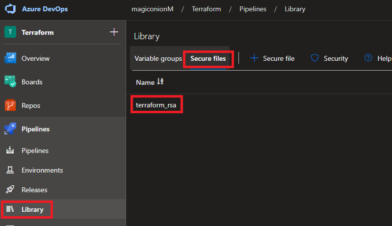
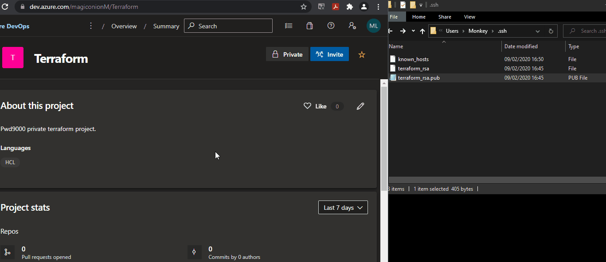

## Terraform module sources?

Terraform supports many different [Module Sources](https://www.terraform.io/docs/language/modules/sources.html). In todays tutorial we look at how we can configure an Azure DevOps repo with SSH and use this repo as a module source in terraform. We will also take a look at how we can use the **install SSH key** DevOps task in a pipeline that runs terraform so that the DevOps agent running the terraform deployment can connect to the DevOps repo as a source over SSH.

## Step 1: Prepare SSH Key

First we have to create a SSH key pair:  

- Install Git for windows.
- In a powershell console run: `ssh-keygen`. This will create a private key: `id_rsa` and a public key: `id_rsa.pub` under the following path: `%UserProfile%/.ssh`.
- If a passphrase was used in the creation of the key pair, make a note of the passphrase as we will need it later on.
- Next run: `ssh-keyscan -H -t rsa ssh.dev.azure.com > $env:userprofile/.ssh/known_hosts`. The content of the file will be used later on in the setup of the [Install SSH Key](https://github.com/MicrosoftDocs/azure-devops-docs/blob/master/docs/pipelines/tasks/utility/install-ssh-key.md) devops task in our DevOps pipeline.

## Step 2: Prepare Azure Devops

- Copy the private key file created in the previous step `id_rsa` into azure **pipelines -> Library -> Secure files**. The file can be renamed to make it more friendly to use later on in the [Install SSH Key](https://github.com/MicrosoftDocs/azure-devops-docs/blob/master/docs/pipelines/tasks/utility/install-ssh-key.md) devops task. In my case I have renamed my private key to `terraform_rsa`.

    

- Under the **user settings** in Azure Devops go to SSH public keys and select **Add**. Give a name and add the contents of the file created `id_rsa.pub`. In my case I have renamed my public key to `terraform_rsa.pub`.

    

