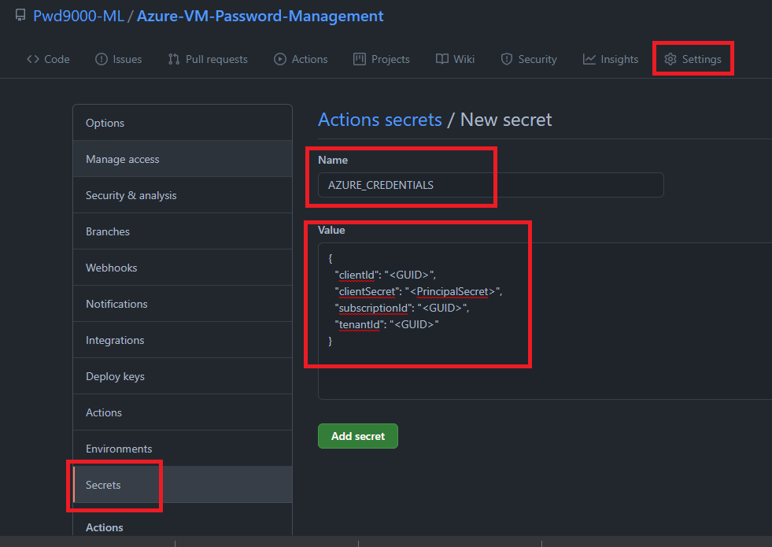

## :bulb: How to rotate VM passwords using Github workflows with Azure Key Vault

### Overview

Today we are going to look at how we can implement a zero-touch fully automated solution under 15 minutes to rotate all our virtual machine local administrator passwords on a schedule by using a single Github workflow and a centrally managed Azure key vault. In our use case we want to be able to rotate the local administrator password of all virtual machines hosted in an Azure subscription, trigger the rotation manually or on a schedule, ensure each VM has a randomized unique password, and access/store the rotated admin password for each virtual machine inside of the key vault we have hosted in Azure.  

In this tutorial we will create a new Azure key vault and a single github workflow as well as a service principal / Azure identity to fully automate everything. We will then populate our key vault with secrets, where the `secret key` will be the `VM hostname` and the `secret value` of the corresponding key will be the `VM password`. (Don't worry about setting an actual password just yet, because out github workflow will update this value for us when we create the github workflow and trigger it later in the tutorial). What's important is that the `secret key` is named the same as what the `VM hostname` is named.  

When our github workflow is triggered the workflow will connect to our key vault to retrieve all the `secret keys` (in our case these keys will reflect the names of our `VM hostnames`). The workflow will then generate a unique randomized password and update the corresponding `secret value` for the VM as well as update the VM itself with the newly generated password.  

This means that whenever we need to connect to a VM in our subscription using the VMs `local admin account` we would go to our centrally managed key vault and look up the VM name `key` and get it's password `value` to be able to connect to our server, as this password will change automatically on a regular basis by our automation. The virtual machine in this case will be defined in our key vault and have its corresponding password in the key value. This gives us the ability to centrally store, access and maintain all our Azure virtual machines local admin passwords from a central key vault in Azure and our passwords will also be automatically rotated on a regular basis without any manual work. We only need to ensure that the VMs that we want to rotate passwords on have corresponding keys in the key vault, we do also not have to add all our VM names as keys if we do not want to rotate every single VM password and only add the servers in our key vault we do want the passwords to rotate. In fact I would recommend not having domain controller names in the key vault as we would not want to rotate the local admin passwords for servers of this kind.  

**Note:** Maintaining all VM password rotation using an Azure key vault is particularly useful for security or ops teams who maintain secrets management and ned to ensure that local admin passwords must rotate on a regular basis.

### Protecting secrets in github

Before we start, a quick word on secrets management in Github. When using Github workflows you need the ability to authenticate to Azure, you may also need to sometimes use passwords, secrets, API keys or connection strings in your source code in order to pass through some configuration of a deployment which needs to be set during the deployment. So how do we protect these sensitive pieces of information that our deployment needs and ensure that they are not in our source control when we start our deployment?  

There are a few ways to handle this. One way is to use [Github Secrets](https://docs.github.com/en/actions/reference/encrypted-secrets). This is a great way that will allow you to store sensitive information in your organization, repository, or repository environments. In fact we will set up a github secret later in this tutorial to authenticate to Azure to connect to our key vault, retrieve server names and set/change passwords. Even though this is a great feature to be able to have secrets management in Github, you may be looking after many repositories all with different secrets, this can become an administrative overhead when secrets or keys need to be rotated on a regular basis for best security practice.  

This is where [Azure key vault](https://docs.microsoft.com/en-gb/azure/key-vault/general/overview) can be utilized as a central source for all our secret management in our GitHub workflows.  

**Note:** Azure key vaults are also particularly useful for security or ops teams who maintain secrets management, instead of giving other teams access to our deployment repositories in Github, teams who look after deployments no longer have to worry about giving access to other teams in order to manage secrets as secrets management will be done from an Azure key vault which nicely separates roles of responsibility when spread across different teams.  

### Let's get started. What do we need to start rotating our VM password?

1. **Azure key vault:**
    This will be where we centrally store and manage all our VM passwords.  
2. **Azure AD App & Service Principal:**
    This is what we will use to authenticate to Azure from our github workflow
3. **Github repository:**
    This is where we will keep our source control and Github workflow

### Create an Azure Key Vault

For this step I will be using Azure CLI using a powershell console. First we will log into Azure by running:  

```powershell
az login
```

Next we will create a `resource group` and `key vault` by running:

```powershell
az group create --name "Github-Assets" -l "UKSouth"
az keyvault create --name "github-secrets-vault33" --resource-group "Github-Assets" --location "UKSouth" --enable-rbac-authorization
```

As you see above we use the option `--enable-rbac-authorization`. The reason for this is because our service principal we will create in the next step will access this key vault using the RBAC permission model. You can also create an Azure key vault by using the Azure portal. For information on using the portal see this [link](https://docs.microsoft.com/en-us/azure/key-vault/general/quick-create-portal).  

### Create an Azure AD App & Service Principal

Next we will create our `Azure AD App` by running the following in a powershell console window:

```powershell
# a name for our azure ad app
$appName="GitHubSecretsUser"

# create Azure AD app
az ad app create --display-name $appName --homepage "http://localhost/$appName" --identifier-uris "http://localhost/$appName"
```

Next we will retrieve the App ID and set it to a powershell variable `$appId`

```powershell
# get the app id
$appId=$(az ad app list --display-name $appName --query [].appId -o tsv)
```

Now that we have our `appId` we can create our service principal and also give our principal the correct `Role Based Access Control (RBAC)` permissions on our key vault we created earlier. We will give our principal the RBAC/IAM role: [Key Vault Secrets Officer](https://docs.microsoft.com/en-us/azure/role-based-access-control/built-in-roles#key-vault-secrets-officer) because we want our workflow to be able to retrieve `secret keys` and also set each `key value`.

```powershell
$subscriptionId=$(az account show --query id -o tsv) # You can change this value t the subscription ID where the key vault resides
$resourceGroup="Github-Assets"
$keyVaultName="github-secrets-vault3"

az ad sp create-for-rbac --name $appId `
    --role "Key Vault Secrets Officer" `
    --scopes /subscriptions/$subscriptionId/resourceGroups/$resourceGroup/providers/Microsoft.KeyVault/vaults/$keyVaultName `
    --sdk-auth
```

The above command will output a JSON object with the role assignment credentials that provide access to your key vault. Copy this JSON object for later. You will only need the sections with the `clientId`, `clientSecret`, `subscriptionId`, and `tenantId` values:

```JSON
{
  "clientId": "<GUID>",
  "clientSecret": "<PrincipalSecret>",
  "subscriptionId": "<GUID>",
  "tenantId": "<GUID>"
}
```

We also want to give our `clientId` permissions on our subscription in order to look up VMs as well as set/change VM passwords. We will grant our service principal identity the following RBAC role: [Virtual Machine Contributor](https://docs.microsoft.com/en-us/azure/role-based-access-control/built-in-roles#virtual-machine-contributor). Run the following command:

```powershell
az role assignment create --assignee "<clientId>" `
    --role "Virtual Machine Contributor" `
    --subscription "<SubscriptionId-where-keyvault-and-Vms-are-hosted>"
```

### Configure our GitHub repository

Next we will configure our Github repository and Github workflow. My Github repository is called `Azure-VM-Password-Management`. You can also take a look or even use my github repository as a template [HERE](https://github.com/Pwd9000-ML/Azure-VM-Password-Management).  

Remember at the beginning of this post I mentioned that we will create a github secret, we will now create this secret on our repository which will be used to authenticate our Github workflow we will set up to Azure.

1. In [GitHub](https://github.com), browse your repository.

2. Select Settings > Secrets > New repository secret.

3. Paste the JSON output from the Azure CLI command into the secret's value field. Give the secret the name `AZURE_CREDENTIALS`.



### Configure our GitHub workflow

Now create a folder in the repository called `.github` and underneath another folder called `workflows`. In the workflows folder we will create a YAML file called `rotate-vm-passwords`. The YAML file can also be accessed [HERE](https://github.com/Pwd9000-ML/Azure-VM-Password-Management/blob/master/.github/workflows/rotate-vm-passwords.yml).

```yaml
// code/rotate-vm-passwords.yml
```

### _Author_

Marcel.L - pwd9000@hotmail.co.uk