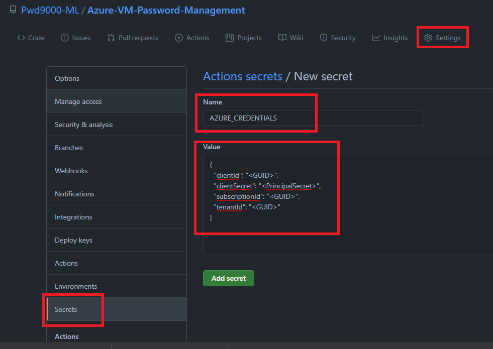

## :bulb: How to protect secrets in Github with Azure Key Vault

### Overview

Today we are going to look at how we can secure secrets that we are using in our Github source control by utilizing Azure Key Vault.  
When you deploy resources in Azure using Github workflows you need the ability to authenticate to Azure, you may also need to sometimes use passwords, secrets, API keys or connection strings in your source code in order to pass through some configuration of the deployment which needs to be set during the deployment. So how do we protect these sensitive pieces of information that our deployment needs and ensure that they are not in our source control when we start our deployment?  

There are a few ways to handle this. One way is to use [Github Secrets](https://docs.github.com/en/actions/reference/encrypted-secrets). This is a great way that will allow you to store sensitive information in your organization, repository, or repository environments. In fact we will set up a github secret later in this tutorial to authenticate to Azure. Even though this is a great feature to be able to have secrets management in Github, you may be looking after many repositories all with different secrets, this can become an administrative overhead when secrets or keys need to be rotated on a regular basis for best security practice.  

This is where [Azure key vault](https://docs.microsoft.com/en-gb/azure/key-vault/general/overview) can be utilized as a central source for all our secret management in our GitHub workflows.  

**Note:** Azure key vaults are also particularly useful for security or ops teams who maintain secrets management, instead of giving other teams access to our deployment repositories in Github teams who look after deployments no longer have to worry about giving access to other teams in order to manage secrets as secrets management will be done from an Azure key vault which nicely separates roles of responsibility when spread across different teams.  

### What do we need?

1. **Azure key vault:**
    This will be where we manage all our secrets we are going to use in our Github source control.  
2. **Azure AD App & Service Principal:**
    This is what we will use to authenticate to Azure from our github workflows
3. **Github repository:**
    This is where we are keeping our source control and Github workflows

### Create an Azure Key Vault

For this step I will be using Azure CLI using a powershell console. First we will log into Azure by running:  

```powershell
az login
```

Next we will create a `resource group` and `key vault` by running:

```powershell
az group create --name "Github-Assets" -l "UKSouth"
az keyvault create --name "github-secrets-vault" --resource-group "Github-Assets" --location "UKSouth" --enable-rbac-authorization
```

As you see above we use the option `enable-rbac-authorization`. The reason for this is because our service principal we will create next will access this key vault using the RBAC permission model. You can also create an Azure key vault by using the Azure portal. Check this [link](https://docs.microsoft.com/en-us/azure/key-vault/general/quick-create-portal).  

### Create an Azure AD App & Service Principal

Next we will create our `Azure AD App` by running:

```powershell
# a name for our azure ad app
$appName="GitHubSecretsUser"

# create Azure AD app
az ad app create --display-name $appName --homepage "http://localhost/$appName" --identifier-uris "http://localhost/$appName"
```

Next we will retrieve the App ID and set it to a powershell variable `$appId`

```powershell
# get the app id
$appId=$(az ad app list --display-name $appName --query [].appId -o tsv)
```

Now that we have our App Id we can create our service principal and also give our principal the correct `Role Based Access Control (RBAC)` permissions on our key vault we created earlier. We will give our principal the RBAC/IAM role: `Key Vault Secrets User`

```powershell
$subscriptionId=$(az account show --query id -o tsv) # You can change this value t the subscription ID where the key vault resides
$resourceGroup="Github-Assets"
$keyVaultName="github-secrets-vault"

az ad sp create-for-rbac --name $appId `
    --role "Key Vault Secrets User" `
    --scopes /subscriptions/$subscriptionId/resourceGroups/$resourceGroup/providers/Microsoft.KeyVault/vaults/$keyVaultName `
    --sdk-auth
```

The above command will output a JSON object with the role assignment credentials that provide access to your key vault. Copy this JSON object for later. You will only need the sections with the `clientId`, `clientSecret`, `subscriptionId`, and `tenantId` values:

```JSON
{
  "clientId": "<GUID>",
  "clientSecret": "<PrincipalSecret>",
  "subscriptionId": "<GUID>",
  "tenantId": "<GUID>"
}
```

### Configure our GitHub repository

Next we will configure our Github repository and Github workflow. In my case I want to be able to change the local administrator password of a virtual machine hosted in Azure using a Github workflow, but managing the local admin passwords for my virtual machines from the key vault. Manually triggering my github workflow will connect to my key vault to retrieve the virtual machine names and passwords and set all the virtual machines I have defined in my key vault with a password I have defined in the key vault. This will give me the ability to centrally manage and maintain all my Azure virtual machine local admin passwords from a key vault hosted in Azure and automatically set those passwords when I trigger my github workflow.  
**Note:** This is particularly useful for security or ops teams who maintain secrets management and ned to ensure that local admin passwords must rotate on a regular basis.

My Github repository is called `Azure-VM-Password-Management`  
Remember at the beginning of this post I mentioned that we will create a github secret, we will now create this secret on our repository which will be used to authenticate our Github workflow we will set up to Azure.

1. In [GitHub](https://github.com), browse your repository.

2. Select Settings > Secrets > New repository secret.

3. Paste the JSON output from the Azure CLI command into the secret's value field. Give the secret the name `AZURE_CREDENTIALS`.



### _Author_

Marcel.L - pwd9000@hotmail.co.uk